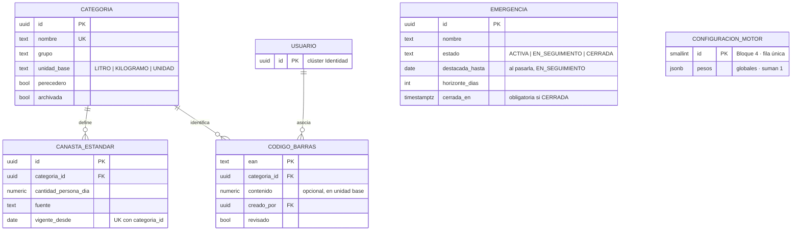
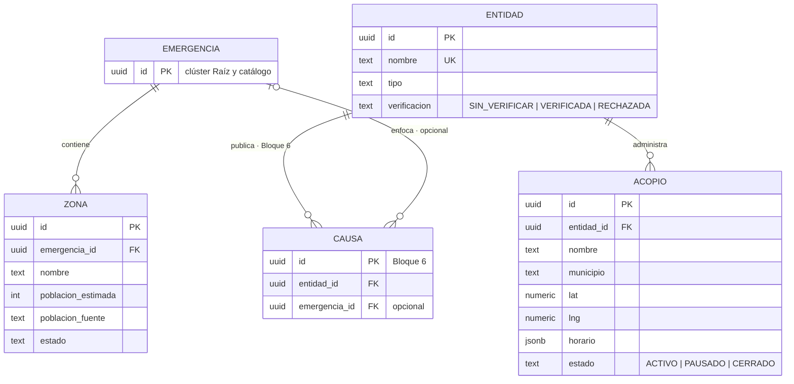
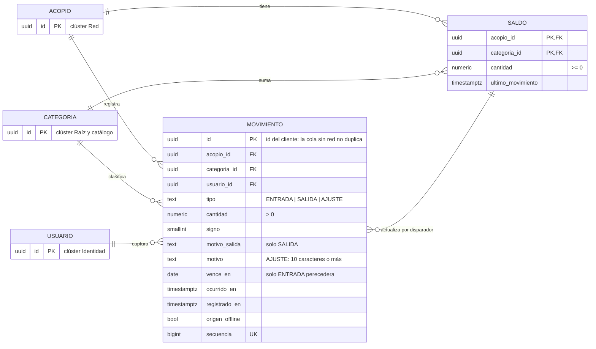
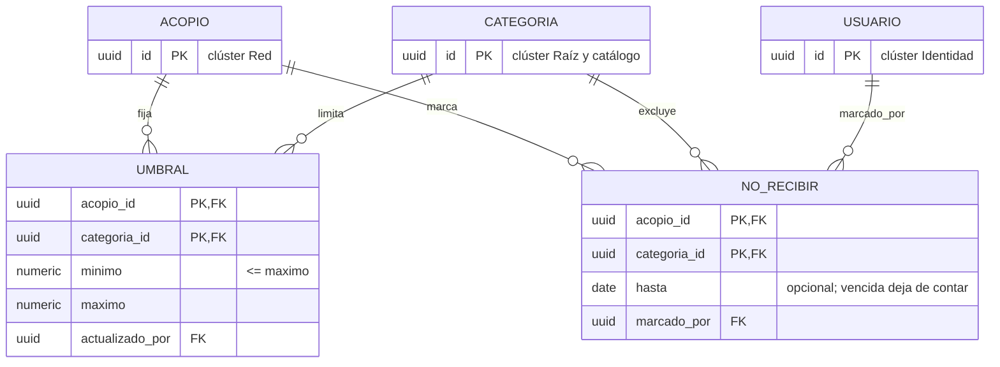
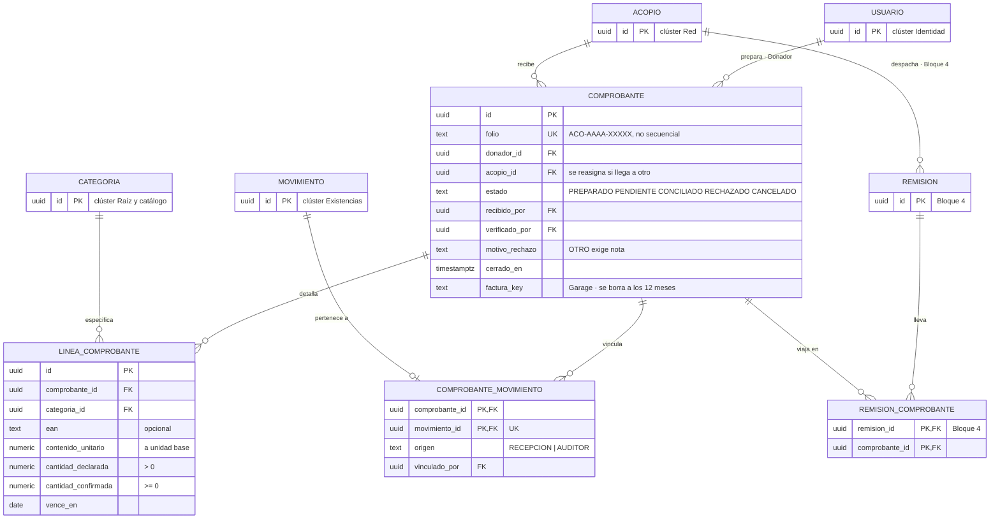
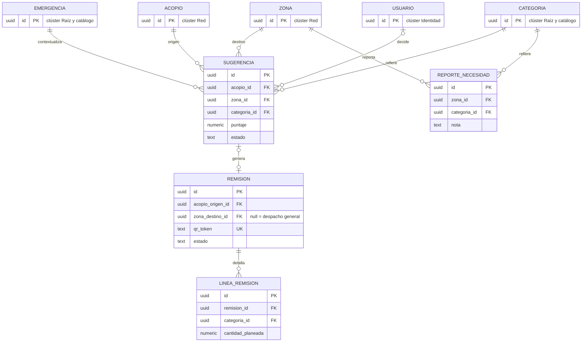
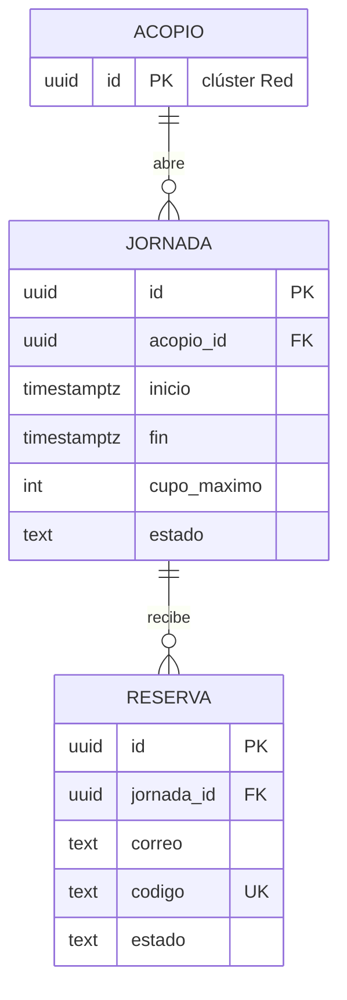
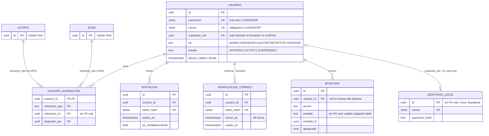
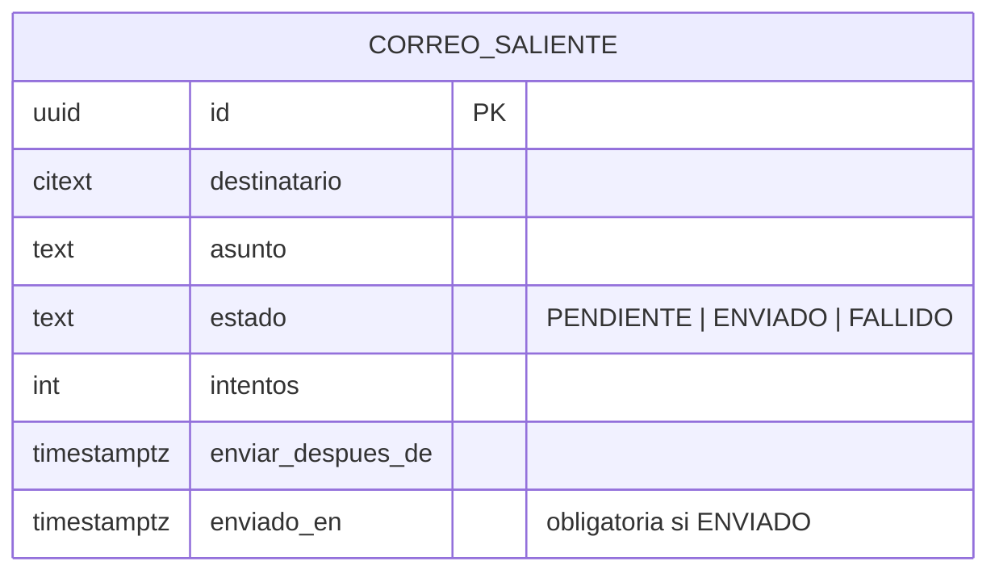

# Modelo de datos

PostgreSQL 16 · Prisma. Nombres en español, iguales a los del
[glosario](../00-contexto/glosario.md).

---

## Principio rector

**El saldo no se guarda. Se deriva de movimientos inmutables.**

```
Movimiento  →  solo inserción  →  Saldo (tabla que mantiene un disparador)
```

Tres propiedades que se obtienen gratis:

1. **Explicabilidad** — «¿por qué hay 1.240 L?» se responde con los 37 movimientos.
2. **Auditoría** — no hay que construirla; es la tabla misma.
3. **Sincronización offline sin conflictos** — un movimiento es un hecho, no un
   estado. Reenviar la cola en orden basta.

---

## Diagrama

Lo construido hasta el Bloque 3. Entre corchetes, lo que llega en un bloque posterior.

```
Emergencia ─┬─ Zona ───── [ReporteNecesidad · Bloque 4]
            └─ [Sugerencia (Acopio → Zona) · Bloque 4]

Entidad ────── Acopio ──┬─ Movimiento ──── ComprobanteMovimiento ── Comprobante ── LineaComprobante
                        ├─ Saldo (por disparador)
                        ├─ Umbral
                        ├─ NoRecibir
                        ├─ [Remision ── LineaRemision · Bloque 4]
                        └─ [Jornada ── Reserva · Bloque 5]

Categoria ──┬─ CanastaEstandar
            ├─ CodigoBarras
            └─ Movimiento · Saldo · Umbral · NoRecibir · LineaComprobante

Usuario ────┬─ UsuarioAsignacion → (Acopio | Zona)
            ├─ Invitacion · VerificacionCorreo · IdentidadLocal (solo local)
            ├─ Bitacora
            └─ Comprobante (como Donador)

CorreoSaliente   cola de correos, sin llaves foráneas
```

---

## Tablas

### Raíz y catálogo

```
emergencia
  id · nombre · tipo · inicio · horizonte_dias (7)
  estado  ACTIVA | EN_SEGUIMIENTO | CERRADA
  destacada_hasta date        al pasarla, ACTIVA → EN_SEGUIMIENTO (tarea diaria)
  cerrada_en timestamptz? · motivo_cierre text?
  CHECK (estado <> 'CERRADA' OR cerrada_en IS NOT NULL)

configuracion_motor           una sola fila, global (ADR-0010)
  id smallint PK · CHECK (id = 1)
  pesos jsonb   {criticidad, urgencia, proximidad, magnitud} · suman 1
  cantidad_minima numeric · actualizado_por · actualizado_en

categoria
  id · nombre · grupo · unidad_base (LITRO|KILOGRAMO|UNIDAD)
  perecedero bool · sinonimos text[] · archivada bool

canasta_estandar
  id · categoria_id · cantidad_persona_dia numeric
  fuente text NOT NULL · vigente_desde date
  UNIQUE (categoria_id, vigente_desde)

codigo_barras
  ean text PK · categoria_id · creado_por · revisado bool
  descripcion text? · contenido numeric?    unidad base que trae una unidad
```

`codigo_barras.contenido` es opcional: con él, quien escanea cuenta presentaciones
—12 botellas— y el sistema convierte a la unidad base de la categoría; sin él, la
cantidad se escribe directo en la unidad base.

`canasta_estandar` es versionada por `vigente_desde`: cambiar la canasta no
reescribe el histórico. El campo `fuente` es obligatorio — sin cita, el cálculo de
necesidad no se puede defender.

### Red

```
entidad
  id · nombre · tipo · nit · sitio_web · contacto · logo_url
  verificacion  SIN_VERIFICAR | VERIFICADA | RECHAZADA
  verificada_por · verificada_en · vence_en · documento_soporte_key

causa
  id · entidad_id · emergencia_id? · titulo · categoria_causa · descripcion · imagen_url
  pasos jsonb   [{orden, texto}]
  url_oficial · publicada bool
  vigente_hasta date?          opcional · pasada, se archiva sola
  archivada bool DEFAULT false · archivada_en timestamptz?
  CHECK (NOT archivada OR archivada_en IS NOT NULL)

acopio
  id · entidad_id? · nombre · direccion · lat · lng
  telefono · horario jsonb · indicaciones_acceso
  estado  ACTIVO | PAUSADO | CERRADO
  tipo    OPERADO | REFERENCIADO      REFERENCIADO = importado, sin inventario
  fuente text? · fuente_id text? · fuente_actualizado_en timestamptz?
  fuente_estado text? · fuente_necesidades jsonb?   copia textual de la fuente
  oculto_por_admin bool DEFAULT false
  UNIQUE (fuente, fuente_id)
  CHECK (tipo = 'OPERADO' OR fuente IS NOT NULL)
  CHECK (tipo = 'REFERENCIADO' OR entidad_id IS NOT NULL)

zona
  id · emergencia_id · nombre · municipio · lat · lng
  poblacion_estimada int · poblacion_fuente · poblacion_fecha
  estado  SIN_ATENDER | EN_ATENCION | CUBIERTA
```

**La emergencia es de la zona, no del acopio (2026-09-14,
[ADR-0010](adr/ADR-0010-varias-emergencias-activas.md)).** Pueden estar activas
varias emergencias, y un mismo acopio atiende a todas: por eso `acopio`, `entidad` y
`movimiento` no tienen `emergencia_id`. `zona` sí lo tiene, y `causa` de forma
opcional. La emergencia de una `RECEPCION` se conoce por su zona.

**`causa.archivada` no es lo mismo que despublicar.** Una causa archivada sigue
visible, con su sello y su fecha — solo sale del espacio principal para dejarle
lugar a lo que necesita atención ahora (2026-09-12, P-019). Ver
[RF-RED-010](../01-requerimientos/funcionales/red.md#rf-red-010--archivar-una-causa).

**Dos clases de acopio (2026-09-14, P-022).** Un acopio `OPERADO` usa Acopio:
tiene entidad, inventario, umbrales, turnos y personas asignadas. Uno
`REFERENCIADO` llega de una fuente externa —la primera, RedAcopio Bogotá— y solo
aparece en el mapa y el directorio con los datos de su fuente, copiados tal cual:
su estado original en `fuente_estado`, sus necesidades en texto libre en
`fuente_necesidades`, sin traducirlas al catálogo. `fuente` + `fuente_id` hacen
que reimportar actualice en vez de duplicar. Ver
[RF-RED-011](../01-requerimientos/funcionales/red.md#rf-red-011--importar-acopios-de-una-fuente-externa).

### Existencias — el núcleo

```
movimiento
  id                uuid pk         lo genera el cliente: la cola sin red no duplica
  acopio_id         fk
  categoria_id      fk
  tipo              ENTRADA | SALIDA | AJUSTE
  cantidad          numeric(12,3)   siempre > 0
  signo             smallint        +1 | -1; ENTRADA suma y SALIDA resta
  motivo_salida     ENTREGA_FAMILIAS | TRASLADO | VENCIDO | OTRO   solo en SALIDA
  nota              text?           obligatoria si el motivo es TRASLADO u OTRO
  motivo            text?           obligatorio si tipo = AJUSTE (10 caracteres o más)
  vence_en          date?           solo en ENTRADA; obligatoria si es perecedera
  usuario_id        fk
  ocurrido_en       timestamptz     cuándo pasó en el mundo real
  registrado_en     timestamptz     cuándo llegó al sistema
  origen_offline    bool
  secuencia         bigint UNIQUE   orden de llegada; ordena el historial

  índices: (acopio_id, categoria_id, registrado_en) · (registrado_en)
```

**Sin `UPDATE` ni `DELETE`.** No basta con no escribirlos en el código: se revoca
el permiso a nivel de base de datos. Un error se corrige con un `AJUSTE` de signo
contrario.

`ocurrido_en` frente a `registrado_en` es lo que hace honesto el modo offline: un
movimiento capturado sin señal a las 3:14 pm y sincronizado a las 6:02 pm conserva
ambas marcas y la interfaz lo distingue.

```
saldo   TABLA que mantiene un disparador AFTER INSERT sobre movimiento
  acopio_id · categoria_id        PK
  cantidad          = Σ (cantidad × signo)     CHECK (cantidad >= 0)
  ultimo_movimiento = max(registrado_en)
```

`ultimo_movimiento` es lo que alimenta la antigüedad visible exigida por RNF-04.

**2026-10-01 · Bloque 2 (V-06, V-08, [ADR-0015](adr/ADR-0015-saldo-en-tabla-por-disparador.md)).**
`saldo` es una tabla, no una vista materializada: la mantiene un disparador `AFTER
INSERT` sobre `movimiento` y tiene `CHECK (cantidad >= 0)`. `movimiento` y `umbral`
llevan `acopio_id` con llave foránea en lugar de `ubicacion_tipo` + `ubicacion_id`; las
zonas sumarán `zona_id` cuando tengan movimientos. `movimiento.tipo` nace sin
`RECEPCION`, gana `motivo_salida` (`ENTREGA_FAMILIAS | TRASLADO | VENCIDO | OTRO`) y
`nota`, y `vence_en` solo se acepta en entradas. `remision_id` llega en su bloque. El vínculo
con un comprobante no vive en `movimiento`: lo guarda `comprobante_movimiento` (ver Custodia). Detalle en la [especificación del Bloque 2](../superpowers/specs/2026-10-01-bloque-2-inventario-design.md#4-datos).

```
umbral
  acopio_id · categoria_id        PK
  minimo numeric · maximo numeric
  actualizado_por fk · actualizado_en
  CHECK (minimo >= 0 AND minimo <= maximo)

no_recibir
  acopio_id · categoria_id        PK
  hasta date?                     vencida deja de contar
  marcado_por fk · marcado_en
```

**2026-09-30 · Bloque 1 (B-06).** «No recibir» salió de `umbral` a su propia tabla,
`no_recibir` (`acopio_id`, `categoria_id`, `hasta`, `marcado_por`, `marcado_en`), con
llaves foráneas reales a `acopio` y `categoria`. `umbral` nace en el Bloque 2 sin esas
columnas: aplica también a zonas, donde «no recibir» no tiene sentido. Una fila con
`hasta` vencido deja de contar al leerla. En el Bloque 1, `acopio` todavía no tiene las
columnas de referenciados (`tipo`, `fuente*`, `oculto_por_admin`) ni `entidad` las de
verificación y logotipo: llegan con el importador y con la verificación.

### Custodia

```
comprobante
  id · folio text UNIQUE       ACO-2026-7KQ4M · sufijo aleatorio, no secuencial
  acopio_id · descripcion
  donador_id fk                 usuario con rol DONADOR · obligatorio, 2026-09-12
  archivos jsonb?               [{key, tipo, tamano, miniatura_key}] · opcional,
                                respaldo adicional, no el dato principal
  estado  PREPARADO | PENDIENTE | CONCILIADO | RECHAZADO | CANCELADO
  motivo_rechazo · verificado_por · verificado_en · creado_en
  CHECK (estado <> 'RECHAZADO' OR motivo_rechazo IS NOT NULL)

  **2026-10-05 · Bloque 3.** `comprobante` guarda `recibido_por`, `recibido_en`,
  `nota_rechazo` y `cerrado_en`. La factura, una por comprobante, ocupa
  `factura_key`, `miniatura_key`, `factura_tipo` y `factura_bytes`; `archivos jsonb` ya
  no existe. Pasados 12 meses de `cerrado_en`, una tarea borra los dos objetos y anota
  `factura_borrada_en`. El folio cumple un `CHECK` con su formato (`ACO-AAAA-` y cinco
  caracteres de un alfabeto de 32, sin I, O, 0 ni 1). `motivo_rechazo` es un enum
  (`DUPLICADO`, `NO_CUADRA_MOVIMIENTOS`, `DIFERENCIA_SIN_EXPLICAR`, `OTRO`) y `OTRO` exige
  `nota_rechazo`.

linea_comprobante
  id · comprobante_id · categoria_id
  ean text? fk                    null si se buscó por palabra clave
  contenido_unitario numeric      copia de codigo_barras.contenido; 1 si no hay
  cantidad_declarada numeric      en unidades del producto · la ajusta el Donador
  cantidad_confirmada numeric?    en unidades del producto · la ajusta el Operador
  vence_en date?                  obligatoria al confirmar si es perecedera
  motivo_diferencia text?
  CHECK (cantidad_declarada > 0 AND cantidad_confirmada >= 0)

  **2026-09-12 · único camino para crear un comprobante.** Se retiró el camino
  anónimo por foto ([RF-CMP-001](../01-requerimientos/funcionales/comprobantes.md),
  descartado — ver [pendientes.md](../01-requerimientos/pendientes.md), P-017):
  un folio sin cuenta detrás es un código que se olvida y no tiene dónde
  recuperarse. Una entrada sin donación preparada sigue siendo posible — el
  Operador la registra como `movimiento` normal, sin comprobante ni folio.

comprobante_movimiento
  comprobante_id fk · movimiento_id fk UNIQUE
  origen RECEPCION | AUDITOR · vinculado_por · vinculado_en
  PK (comprobante_id, movimiento_id)

  Un movimiento pertenece a lo sumo a un comprobante. `RECEPCION` lo escribe el
  Operador al recibir el folio; `AUDITOR` lo escribe quien vincula entradas sueltas.

verificacion_correo
  id · usuario_id fk · token_hash bytea UNIQUE
  vence_en · usado_en? · creado_en
  Guarda el hash del token, nunca el token. Lo crea el registro del Donador (RF-IDE-013).

remision
  id · acopio_origen_id
  zona_destino_id fk?          null = despacho general, sin zona fija al salir
  estado  BORRADOR | EN_TRANSITO | RECIBIDA | CANCELADA
  responsable · qr_token text UNIQUE
  despachada_en · recibida_en · evidencia_keys text[] · nota_recepcion text?
  sugerencia_id fk?
  CHECK (estado <> 'RECIBIDA' OR zona_destino_id IS NOT NULL)

  El Receptor confirma con un botón «Recibido» y al menos una foto —
  `evidencia_keys` — sin conteo por categoría; lo que llegó
  visiblemente distinto va como texto en `nota_recepcion`. Al confirmar,
  `linea_remision.cantidad_recibida` se iguala a `cantidad_planeada` para cada
  línea; un conteo exacto por unidad queda para una fase posterior. Si
  `zona_destino_id` llegó nulo —despacho general—, quien confirma fija su propia
  zona en ese momento, igual que el Operador reasigna el acopio de un folio
  (arriba).

linea_remision
  id · remision_id · categoria_id
  cantidad_planeada numeric · cantidad_recibida numeric?
  motivo_diferencia text?

remision_comprobante
  remision_id · comprobante_id · vinculado_por · vinculado_en
  PK (remision_id, comprobante_id)
```

**Permisos de `acopio_app` (2026-10-05).** `comprobante` y `linea_comprobante`: leer,
insertar y actualizar, sin `DELETE` ni `TRUNCATE`; un comprobante se cancela o se rechaza,
no se borra. `comprobante_movimiento`: solo leer e insertar. `verificacion_correo`: leer,
insertar y actualizar (para marcar `usado_en`), sin `DELETE` ni `TRUNCATE`.

Los archivos guardan **claves del objeto en el almacenamiento (Garage), nunca URLs**. Las URLs son firmadas y de
vida corta; almacenarlas sería guardar algo ya vencido.

**Ciclo de vida del comprobante (2026-09-12, P-018).** `PREPARADO` lo crea el
Donador y todavía no llega al acopio; `PENDIENTE` ya lo recibió un Operador y espera
al Auditor; `CONCILIADO` o `RECHAZADO` los decide el Auditor. `CANCELADO` es un
`PREPARADO` que el Donador anuló o que venció sin entregarse. La bandeja del Auditor
solo ve `PENDIENTE`: lo que todavía no llega no es trabajo suyo. **`CONCILIADO` es
el cierre real de la donación** (P-019) — lo que pasa después con el cargamento es
trazabilidad de mejor esfuerzo, ver `remision_comprobante` abajo.

**Por qué `contenido_unitario` se copia en la línea.** Quien escanea cuenta
presentaciones —12 botellas—, no litros. La `ENTRADA` que se genera al confirmar
lleva `cantidad_confirmada × contenido_unitario`, en la unidad base. Se copia y no
se consulta en vivo: si alguien corrige después el contenido de ese código, una
donación ya hecha no debe cambiar de tamaño.

**Por qué existe `remision_comprobante`.** El saldo es una suma, no lotes
([ADR-0002](adr/ADR-0002-saldo-derivado.md)): no hay forma automática de saber qué
entrada alimentó qué salida, y varios camiones salen de un mismo acopio, a veces
sin destino fijo. La donación se cierra para el Donador al conciliarse, no al
vincularse a una remisión. El vínculo lo declara el Operador al despachar, de
forma opcional y de mejor esfuerzo — riesgo aceptado, no garantía (P-019). Sin
vínculo, el folio se queda en «conciliado, en el acopio» — no se inventa un
destino.

### Motor

```
sugerencia
  id · emergencia_id · acopio_id · zona_id · categoria_id
  cantidad numeric · puntaje numeric
  desglose jsonb    {criticidad, urgencia, proximidad, magnitud}
  justificacion text
  estado  PROPUESTA | APROBADA | DESCARTADA
  motivo_descarte · decidida_por · decidida_en · generada_en
```

`desglose` guarda los cuatro componentes por separado: sin ellos, el ranking es
una caja negra y la justificación no se puede reconstruir a posteriori.

```
reporte_necesidad
  id             uuid pk
  zona_id        fk
  categoria_id   fk
  reportado_por  fk           usuario con rol RECEPTOR
  nota           text?
  resuelta       bool         true = ya no hace falta · cierra la necesidad
  reportado_en   timestamptz
```

**Append-only, igual que `movimiento`.** No admite `UPDATE` ni `DELETE` — se revoca
el permiso a nivel de base de datos. Complementa el cálculo automático de
`sugerencia`: la canasta estándar predice cantidades genéricas por persona y día,
pero no lo que el Receptor ve en el terreno y ninguna fórmula anticipa. La
necesidad vigente de una categoría en una zona es su `reporte_necesidad` más
reciente —si ese último viene marcado `resuelta`, no hay necesidad vigente; así se
retira una necesidad sin borrar nada—. Se deriva, no se guarda aparte, mismo
principio que [ADR-0002](adr/ADR-0002-saldo-derivado.md).

### Turnos

```
jornada
  id · acopio_id · inicio · fin · cupo_maximo int
  descripcion · requisitos jsonb · perfil_requerido?
  cupos_ajuste_manual int DEFAULT 0
  ajuste_actualizado_en · estado  ABIERTA | CERRADA | CANCELADA

reserva
  id · jornada_id · nombre · correo · telefono?
  codigo text UNIQUE · estado  ACTIVA | CANCELADA | ASISTIO | NO_ASISTIO
  consentimiento_en timestamptz NOT NULL
  UNIQUE (jornada_id, correo)
```

`cupos_ajuste_manual` es la salida para quien llega sin reservar:
`libres = cupo_maximo − reservas_activas − cupos_ajuste_manual`.

### Identidad

```
usuario
  id · username citext UNIQUE? · nombre · correo citext UNIQUE?
  rol  ADMIN | OPERADOR | AUDITOR | RECEPTOR | DONADOR
  supabase_uid uuid UNIQUE? · estado INVITADO | ACTIVO | SUSPENDIDO
  correo_sintetico bool
  tokens_validos_desde timestamptz?   tokens emitidos antes se rechazan (RF-IDE-009)
  CHECK (rol = 'DONADOR' OR username IS NOT NULL)
  CHECK (rol <> 'DONADOR' OR (correo IS NOT NULL AND NOT correo_sintetico))

  DONADOR es la excepción al resto: se auto-registra —no lo invita el
  Administrador—, inicia sesión por `correo`, no por `username` (por eso
  `username` deja de ser obligatorio), y **no tiene filas en
  `usuario_asignacion`** — no gestiona un acopio ni una zona, elige a cuál
  entregar en cada donación.

usuario_asignacion
  usuario_id · ubicacion_tipo · ubicacion_id
  asignado_por · asignado_en
  PK (usuario_id, ubicacion_tipo, ubicacion_id)
  índice (usuario_id, ubicacion_id)

invitacion
  id · usuario_id · token_hash bytea UNIQUE · expira_en
  usada_en? · revocada_en? · es_restablecimiento bool · motivo? · creada_por? · creada_en
  CHECK (NOT es_restablecimiento OR char_length(motivo) >= 20)

bitacora
  id · usuario_id?  (nulo en acciones del sistema: seed y tareas programadas)
  accion · entidad · entidad_id? · ubicacion_id?  (filtro de C17)
  datos_antes jsonb? · datos_despues jsonb?
  destacado bool · ocurrido_en

identidad_local               solo con AUTH_PROVEEDOR=local (P-025)
  id uuid PK                  es el `sub` del token y el valor de usuario.supabase_uid
  correo citext UNIQUE · password_hash text (bcrypt)
  correo_confirmado_en timestamptz? · creado_en
```

El índice `(usuario_id, ubicacion_id)` es el que permite verificar la autorización
en cada request sin cachearla en el token.

`identidad_local` hace, mientras el desarrollo es local, lo que después hará Supabase
Auth: guardar la credencial. Por eso está aparte de `usuario` y se enlaza igual que
Supabase, por `supabase_uid` y sin llave foránea. Al pasar a Supabase se exporta con
su UUID y su hash, y se elimina
([Bloque 0 §5](../superpowers/specs/2026-09-28-bloque-0-cimientos-design.md#5-datos)).

### Notificaciones

```
correo_saliente
  id · destinatario citext · asunto · cuerpo_texto · cuerpo_html?
  estado  PENDIENTE | ENVIADO | FALLIDO
  intentos int · ultimo_error text? · enviar_despues_de timestamptz
  creado_en · enviado_en?
  CHECK (estado <> 'ENVIADO' OR enviado_en IS NOT NULL)
```

Cola de correos. La tarea «reintentar correos fallidos» toma las filas `FALLIDO` cuyo
`enviar_despues_de` ya pasó; la espera crece con cada intento (1, 2, 4… minutos, hasta
dos horas) y se detiene a los 8 intentos.

**2026-09-28 · construido en el Bloque 0.** Además de las columnas de arriba, la
primera migración crea `acopio_sin_tildes(text)`, una envoltura `IMMUTABLE` de
`unaccent` para la búsqueda de categorías (RF-CAT-002), y el rol `acopio_app` con el
que se conecta la API: tiene `SELECT`, `INSERT`, `UPDATE` y `DELETE` en todas las
tablas, menos `UPDATE`, `DELETE` y `TRUNCATE` sobre `bitacora`. Las tablas futuras
heredan esos permisos; las append-only los revocan en su propia migración.

---

## Invariantes

Cada uno se hace cumplir donde no se pueda evadir.

| Invariante | Dónde |
|---|---|
| `movimiento` no admite `UPDATE` ni `DELETE` | Permisos de base de datos |
| El saldo nunca queda negativo | `CHECK` en `saldo` y candado por acopio y categoría antes de una salida o un ajuste |
| `umbral.minimo <= umbral.maximo` | `CHECK` |
| `AJUSTE` exige motivo de 10 caracteres o más | `CHECK` |
| Una reserva solo existe si hay cupo libre | Transacción con bloqueo sobre la jornada |
| `CONCILIADO` exige al menos un movimiento vinculado | Transacción |
| Una línea de remisión no excede el saldo de origen | Transacción |
| Una causa publicada exige entidad `VERIFICADA` | Transacción |
| No se puede suspender al último `ADMIN` activo | Transacción |
| `reporte_necesidad` no admite `UPDATE` ni `DELETE` | Permisos de base de datos |
| Un usuario interno tiene `username`; un Donador, correo real | `CHECK` |
| Un Donador no tiene filas en `usuario_asignacion` | Transacción |
| `comprobante.donador_id` apunta a un usuario con rol `DONADOR` | Transacción |
| Solo un comprobante `PREPARADO` se puede recibir en el acopio | `UPDATE` condicionado al estado `PREPARADO` |
| `RECHAZADO` exige motivo; `OTRO` exige nota | `CHECK` |
| Un movimiento pertenece a lo sumo a un comprobante | `UNIQUE (movimiento_id)` en `comprobante_movimiento` |
| `comprobante_movimiento` no admite `UPDATE` ni `DELETE` | Permisos de base de datos |
| El folio sigue el formato `ACO-AAAA-XXXXX` | `CHECK` |
| Un cambio de estado de un comprobante no pisa otro concurrente | `UPDATE` condicionado al estado leído |
| Línea de comprobante: declarado > 0, confirmado ≥ 0 | `CHECK` |
| Una remisión `RECIBIDA` tiene zona — un despacho general la toma al recibirse | `CHECK` |
| Una causa archivada tiene fecha de archivado | `CHECK` |
| Un acopio `REFERENCIADO` tiene fuente; uno `OPERADO` tiene entidad | `CHECK` |
| Un punto importado existe una sola vez por fuente | `UNIQUE (fuente, fuente_id)` |
| Un acopio `REFERENCIADO` no tiene movimientos, umbrales, jornadas ni asignaciones | Transacción |
| Una emergencia `CERRADA` tiene fecha de cierre | `CHECK` |
| Una emergencia `CERRADA` no recibe zonas nuevas ni genera sugerencias | Transacción |
| `configuracion_motor` tiene una sola fila y sus pesos suman 1 | `CHECK` |
| `bitacora` no admite `UPDATE` ni `DELETE` | Permisos de base de datos (rol `acopio_app`) |
| Un correo `ENVIADO` tiene fecha de envío | `CHECK` |

**Lo que se puede expresar en el esquema, va en el esquema.** Una regla que solo
vive en el código de la aplicación se rompe el día que alguien escribe un script.

---

## Estrategia de saldos

`saldo` es una tabla que mantiene un disparador `AFTER INSERT` sobre `movimiento`
([ADR-0015](adr/ADR-0015-saldo-en-tabla-por-disparador.md)). PostgreSQL no refresca una
vista materializada por fila, así que la vista materializada que proponía la primera
versión de este modelo nunca se construyó. `acopio_app` solo lee `saldo`; si una salida
dejara la cantidad negativa, el `CHECK` aborta la transacción. Antes de una salida o un
ajuste, la API toma `pg_advisory_xact_lock` por acopio y categoría para que dos
operaciones simultáneas se ordenen.

---

## Diagrama entidad-relación

Actualizado el 2026-10-06 con el esquema construido hasta el Bloque 3
(`prisma/schema.prisma`). Las tablas que todavía no existen se dibujan con la nota
«Bloque N», el bloque que las construye: `causa` (Bloque 6), `remision`,
`linea_remision`, `remision_comprobante`, `sugerencia`, `reporte_necesidad` y
`configuracion_motor` (Bloque 4), y `jornada` y `reserva` (Bloque 5).

**Un diagrama por clúster.** Con más de 25 entidades, un solo `erDiagram` de Mermaid
no se puede leer, así que se divide en los grupos de la sección [Tablas](#tablas).
Cuando una entidad aparece en un clúster solo como referencia de otro, se dibuja
liviana: su llave primaria y una nota de dónde está completa.

Los atributos van abreviados a lo principal: PK, FK y los campos que gobiernan una
regla de negocio. La lista completa de columnas está en [Tablas](#tablas).

### Raíz y catálogo

`emergencia` es la raíz de las zonas afectadas. Pueden estar activas varias, y
acopios, entidades y movimientos no dependen de ella
([ADR-0010](adr/ADR-0010-varias-emergencias-activas.md)). El catálogo (`categoria`,
`canasta_estandar`, `codigo_barras`) sirve para cualquier emergencia.



### Red



### Existencias — el núcleo

El saldo se deriva de movimientos inmutables
([ADR-0002](adr/ADR-0002-saldo-derivado.md)) y lo guarda la tabla `saldo`, que mantiene
un disparador sobre `movimiento` ([ADR-0015](adr/ADR-0015-saldo-en-tabla-por-disparador.md)).
Hoy los movimientos, saldos y umbrales son de un acopio, con llave foránea real; las
zonas sumarán su propia columna cuando tengan movimientos (Bloque 4). Se dibuja en dos
diagramas: los movimientos con su saldo, y lo que el Operador fija por categoría.





### Custodia

Una donación preparada por un Donador es un `comprobante` con sus líneas. Al recibirla
se crean las entradas, y `comprobante_movimiento` une cada entrada con su donación: un
movimiento pertenece a lo sumo a una. La tabla solo admite inserción. Las remisiones
llegan con el motor (Bloque 4).



### Motor

Se construye en el Bloque 4. Es el aporte original del proyecto
([spec §7](../superpowers/specs/2026-08-20-acopio-design.md)).



### Turnos

Se construye en el Bloque 5.



### Identidad



### Notificaciones

`correo_saliente` no tiene llaves foráneas: guarda el destinatario como texto. Cada
servicio lo encola dentro de la transacción de la operación, y una tarea programada
envía cada minuto.



### Roles secundarios de `usuario` no dibujados

Varias tablas referencian a `usuario` más de una vez con roles distintos:
`comprobante.recibido_por`, `comprobante.verificado_por`,
`comprobante_movimiento.vinculado_por`, `umbral.actualizado_por`,
`invitacion.creada_por` y `usuario_asignacion.asignado_por`, y más adelante
`sugerencia.decidida_por`. Cada clúster dibuja solo su relación principal con
`usuario`; las demás están en la lista de columnas de cada tabla, en [Tablas](#tablas).

**Restricciones de integridad:** ver la tabla de [Invariantes](#invariantes).
