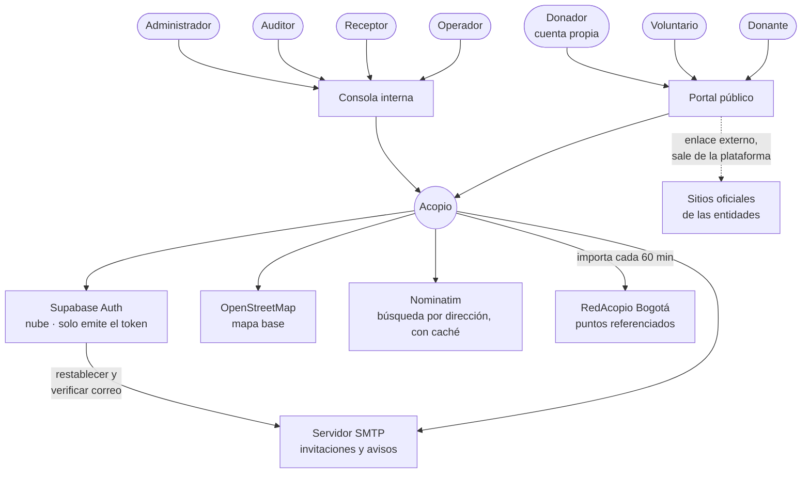
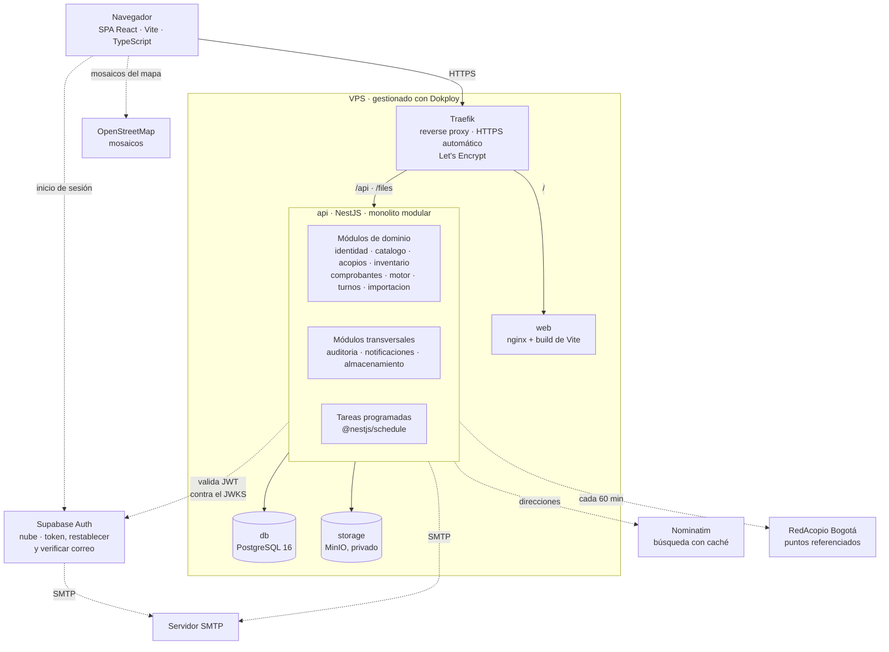

# Vista general de arquitectura

---

## C4 nivel 1 — Contexto



**Sale de la plataforma:** enlaces a los sitios oficiales de las entidades. La
donación de dinero ocurre allá, nunca aquí. Los cuatro roles internos —Operador,
Receptor, Auditor, Administrador— entran por la Consola. El Donador también tiene
cuenta, pero propia —se registra solo— y entra por el Portal público; el resto son
públicos, sin cuenta ([actores.md](../00-contexto/actores.md)).

## C4 nivel 2 — Contenedores



**Cómo leer el diagrama.** El navegador descarga la SPA desde `web` y habla con
la API por HTTPS a través de Traefik; solo va directo a Supabase para iniciar
sesión y a OpenStreetMap por los mosaicos del mapa. La API es un único proceso con
once módulos —ocho de dominio y tres transversales— y sus tareas programadas; es la
única pieza que toca la base de datos, los archivos y los servicios externos: el
servidor SMTP para el correo, Nominatim para buscar direcciones y RedAcopio para
importar puntos referenciados. Supabase usa el mismo servidor SMTP para sus correos.

**MinIO nunca se expone.** Todo archivo pasa por la API, que entrega URLs firmadas
de expiración corta.

**El `proxy: nginx` de antes lo reemplaza Traefik.** Dokploy lo trae incluido:
mismas reglas de enrutamiento (`/` a `web`, `/api` y `/files` a `api`), y encima
resuelve el certificado HTTPS sin configurarlo a mano. Detalle completo en
[despliegue.md](../06-operacion/despliegue.md#producción--vps-con-dokploy).

## Módulos del backend

Un módulo NestJS por límite de dominio. Sin dependencias circulares; cuando dos
módulos necesitan hablarse, lo hacen por una interfaz declarada, no importando
clases internas.

| Módulo | Responsabilidad | Expone |
|---|---|---|
| `identidad` | Usuarios, invitaciones, auto-registro de Donador, roles, asignaciones, guard | `AuthGuard`, `ScopeGuard`, `UsuarioService` |
| `catalogo` | Categorías, unidades, canasta, códigos de barras, emergencias | `CategoriaService`, `CanastaService` |
| `acopios` | Acopios operados y referenciados, zonas, entidades, causas y su archivado. Búsqueda por dirección con Nominatim y caché | `UbicacionService` |
| `inventario` | Movimientos, saldos, umbrales, no recibir | `MovimientoService`, `SaldoService` |
| `comprobantes` | Preparación por escaneo, sugerencia de acopio, recepción, conciliación, folios | `ComprobanteService` |
| `motor` | Déficit, superávit, sugerencias, remisiones y despacho general, vínculo folio–remisión, necesidad reportada | `MotorService`, `RemisionService` |
| `turnos` | Jornadas, reservas, cupos | `JornadaService` |
| `auditoria` | Bitácora | `BitacoraService`, interceptor global |
| `notificaciones` | Correo por SMTP: invitaciones, reservas, avisos de folio y de acopio cerrado. Envío con reintentos | `NotificacionService` |
| `almacenamiento` | Archivos en MinIO: facturas, evidencias de remisión, documentos de verificación, logotipos. URLs firmadas | `AlmacenamientoService` |
| `importacion` | Puntos referenciados desde fuentes externas, un adaptador por fuente ([RF-RED-011](../01-requerimientos/funcionales/red.md#rf-red-011--importar-acopios-de-una-fuente-externa)) | `ImportadorService` |

**Validación del 2026-09-14 ([P-023](../01-requerimientos/pendientes.md)):**
`notificaciones` y `almacenamiento` salen como módulos transversales porque cuatro
y tres módulos, respectivamente, los necesitaban —antes el almacenamiento vivía
dentro de `comprobantes` y obligaba a `motor` a depender de él por una foto—.
`importacion` nace con los puntos referenciados. **No hay microservicios:** todo
corre en el mismo proceso, y `importacion` y `notificaciones` hablan con el exterior
a través de adaptadores, de modo que se podrían extraer más adelante sin tocar el
dominio.

### Dependencias permitidas

```
identidad      ← todos           (autorización)
auditoria      ← todos           (registro)
notificaciones ← identidad, acopios, comprobantes, turnos
almacenamiento ← acopios, comprobantes, motor
catalogo       ← inventario, motor
acopios        ← inventario, comprobantes, motor, turnos, importacion
inventario     ← comprobantes, motor
comprobantes   ← motor           (solo lectura, para trazabilidad)
```

`notificaciones` y `almacenamiento` no dependen de ningún módulo de dominio: son
hojas del grafo, y por eso no pueden crear ciclos.

## Tareas programadas

Corren dentro del proceso de la API con `@nestjs/schedule`. Con una sola instancia
no hace falta un orquestador aparte; si algún día hubiera dos, cada tarea se
protege con un bloqueo en PostgreSQL para que no corra dos veces.

| Tarea | Frecuencia | Módulo |
|---|---|---|
| Sincronizar puntos referenciados | Cada 60 min | `importacion` |
| Cancelar folios `PREPARADO` con más de 7 días | Diaria | `comprobantes` |
| Archivar causas vencidas o de entidades con verificación caducada | Diaria | `acopios` |
| Alertas de vencimiento de perecederos | Diaria | `inventario` |
| Reintentar correos fallidos | Cada 5 min | `notificaciones` |

`motor` es el módulo más dependiente y el más profundo. Es también el que se
construye último, cuando sus cimientos ya están firmes.

## Reglas compartidas

`packages/shared` contiene funciones puras, sin dependencias de framework ni de
base de datos:

- Conversión y validación de unidades
- Cálculo de estado del semáforo a partir de saldo y umbral
- Fórmulas de necesidad, déficit, cobertura y superávit
- Puntaje de sugerencia
- Formato de números y fechas en español de Colombia

Las importan tanto la API como el frontend. **Escritas una vez, verificadas con
pruebas una vez.** Sin esto, tarde o temprano el frontend y el backend discrepan
sobre qué significa «escaso», y la discrepancia aparece en producción.

## Flujo de una entrada de inventario

```
1  Operador escanea o busca la categoría          web
2  Ingresa cantidad y confirma                    web
3  POST /api/movimientos                          api
4  AuthGuard valida el JWT contra el JWKS         identidad
5  ScopeGuard verifica la asignación en BD        identidad
6  Transacción:
     inserta movimiento                           inventario
     refresca la fila de saldo                    disparador
     valida que el saldo no quede negativo        CHECK + transacción
     escribe la bitácora                          auditoria
7  Devuelve el saldo resultante                   api
8  Muestra confirmación y nuevo saldo             web
```

Sin conexión, los pasos 3 a 7 se aplazan: el movimiento se encola en IndexedDB con
su `ocurrido_en` y se reenvía al recuperar señal.

## Decisiones registradas

Ver [adr/](adr/). Las de mayor alcance:

- [ADR-0001](adr/ADR-0001-supabase-solo-auth.md) — Supabase solo para autenticación
- [ADR-0002](adr/ADR-0002-saldo-derivado.md) — El saldo se deriva, no se guarda
- [ADR-0003](adr/ADR-0003-rol-global-alcance-multiple.md) — Rol global, alcance múltiple
- [ADR-0004](adr/ADR-0004-frontend-lovable-spa.md) — Frontend SPA generado con Lovable · reemplazada por ADR-0009
- [ADR-0005](adr/ADR-0005-offline-solo-movimientos.md) — Offline limitado a movimientos
- [ADR-0006](adr/ADR-0006-color-semantico-reservado.md) — El color semántico está reservado
- [ADR-0007](adr/ADR-0007-donador-excepcion-rol.md) — El Donador, excepción controlada al modelo de roles
- [ADR-0008](adr/ADR-0008-arquitectura-stack-inicial.md) — Arquitectura y selección tecnológica inicial, el «ADR-001» del curso
- [ADR-0009](adr/ADR-0009-mockups-claude-design.md) — Mockups con Claude Design, interfaz implementada por el equipo
