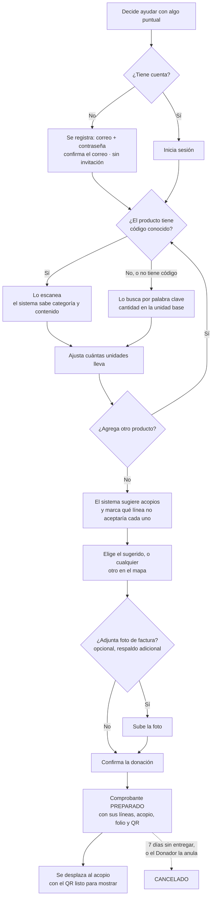
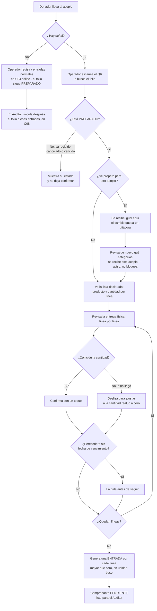
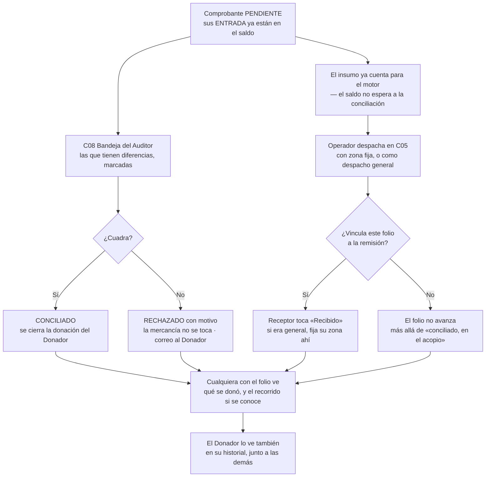

# Flujos críticos

Los seis recorridos que el sistema tiene que hacer bien. Si estos funcionan, el
producto funciona. Los primeros cinco están en Mermaid o en texto según cuándo se
escribieron; el 6 ya sigue la convención en Mermaid (P-008).

---

## 1 · Donar en especie, de la duda a la entrega ~~reemplazado~~

**2026-09-12 · superado por el flujo 6.** Se retiró el comprobante anónimo por
foto (P-017): P09 ahora exige cuenta de Donador. El tramo P01 → P05 → P06 —decidir
qué comprar— sigue igual; lo que cambia es todo lo que pasa después de «compra y se
desplaza», que ahora es el flujo 6a.

```
Enlace de WhatsApp
   ↓
P01 Portada  ──「Donar en especie」
   ↓
P05 Mapa  ── filtra por «qué no recibe» y «abierto ahora»
   ↓
P06 Ficha de acopio  ── ve QUÉ URGE y QUÉ NO TRAER
   ↓
[ compra ]
   ↓
Continúa en el flujo 6a — preparar la donación
```

**Momento decisivo:** P06. Si «qué urge» y «qué no traer» no se leen en dos
segundos, la persona compra lo equivocado y el problema del agua acumulada se
repite.

---

## 2 · Recibir mercancía en el acopio

```
Llega un carro
   ↓
C04 Entrada rápida  ── escanea o busca · cantidad · registrar   ⏱ < 10 s
   ↓
Confirmación en el sitio, foco listo para la siguiente
   ↓
[ repite N veces sin cambiar de pantalla ]
   ↓
C03 Inventario  ── el semáforo se movió
   ↓
Si algo pasó del máximo → C07 marcar «no recibir»
   ↓
Se publica de inmediato en P05 y P06
```

**Momento decisivo:** los diez segundos. Todo el sistema depende de que esta
persona colabore, y solo colabora si es rápido.

**Bifurcación offline:** sin señal, C04 encola en IndexedDB y sigue idéntica. El
indicador muestra cuántos hay pendientes.

---

## 3 · Validar la donación

**2026-09-12 · actualizado.** Ya no hay una foto suelta que interpretar — el
comprobante siempre trae líneas (categoría y cantidad), declaradas por el Donador y
confirmadas por el Operador en el flujo 6b. La factura, si existe, queda como
respaldo al lado.

```
C08 Bandeja de pendientes  ── ordenada por antigüedad
   ↓
Abre uno: líneas declaradas junto a las confirmadas
   ↓ (factura adjunta, si existe, a un toque de distancia)
┌── coinciden ──→ vincular al movimiento → CONCILIADO
└── no coinciden ──→ rechazar con motivo → correo al donador
   ↓
El folio del Donador avanza en P10 y en su historial
```

**Momento decisivo:** que el auditor compare líneas contra líneas, no una foto
contra una lista. Es más rápido de verificar que antes, no solo más preciso.

---

## 4 · Repartir hacia las zonas

**2026-09-12 · actualizado.** La recepción ya no cuenta por categoría
(RF-MOT-009), y el vínculo entre un folio y la remisión que lo lleva lo declara el
Operador al despachar, de forma opcional (RF-CMP-007, P-018). Una remisión puede
salir con zona fija o como **despacho general**; si sale sin zona, quien la
recibe fija la suya al confirmar (P-019).

```
C09 Zonas  ── mapa de criticidad
   ↓
C11 Motor de sugerencias  ── ranking con justificación en texto
   ↓
Aprobar  ── cantidad editable → crea Remision en BORRADOR
   ↓
C05 Despacho  ── vincula folios (opcional) · genera movimientos de SALIDA
   ↓
C12 Remisión EN_TRANSITO  ── imprime QR
   ↓
[ viaja ]
   ↓
C13 Recepción  ── botón «Recibido» + foto · QR opcional · sin conteo
   ↓
Movimientos de RECEPCION en la zona
   ↓
C10 El déficit de la zona baja
   ↓
P10 Los folios vinculados llegan a «recibido en Zona 7»
```

**Momento decisivo:** la justificación en C11. Nadie aprueba mover 500 litros
porque un número diga 0,92.

**Conecta, sin cerrarla, la cadena de custodia**: la donación del flujo 6 ya se
cerró para el Donador al conciliarse; si su folio se vinculó a esta remisión, aquí
avanza a «recibido en destino» como estimado (P-019).

---

## 5 · Dar acceso a una persona nueva

```
ADMIN en C16  ── username · nombre · rol · correo? · ubicaciones
   ↓
Usuario en estado INVITADO
   ↓
Se genera enlace de un solo uso, vence en 7 días
   ↓
Se envía por correo, y queda copiable para WhatsApp
   ↓
PERSONA abre el enlace
   ↓
Ve su username y sus zonas · define su contraseña
   ↓
Backend crea el usuario en Supabase, estampa el UUID
   ↓
Estado ACTIVO · token invalidado
   ↓
Entra con username + contraseña
```

**Momento decisivo:** el administrador nunca conoce ni fija la contraseña. Es lo
que sostiene que no pueda alterar información en nombre de otro.

**Bifurcación sin correo:** el enlace se entrega por WhatsApp. No habrá
recuperación autónoma de contraseña, y el formulario lo advierte al crear.

---

## 6 · Donador con cuenta, de preparar a entregar

**2026-09-12 · adelantado del Bloque 3, fuera del Avance 3.** El Donador es la
única cuenta que no crea el Administrador — se registra solo (P-016). Reemplaza el
comprobante anónimo del flujo 1, retirado en P-017: crear un folio ahora exige
cuenta. Quien no quiere registrarse puede seguir donando, solo que sin folio ni
seguimiento — el Operador lo registra como entrada normal.

### 6a · Preparar la donación



**Momento decisivo:** que escanear sea más rápido que escribir. Si hay que teclear
el nombre de cada producto, la lista se queda a la mitad.

### 6b · Entregar y validar en el acopio



**Momento decisivo:** que ajustar una cantidad sea un gesto, no un formulario. Si
corregir toma tanto como registrar desde cero, el operador deja de usarlo bajo
presión — el mismo riesgo del flujo 2.

### 6c · Conciliar, repartir y hacer seguimiento

**Dos caminos en paralelo, no en serie.** Conciliar y despachar no se esperan: las
`ENTRADA` entran al saldo en 6b, y el motor trabaja sobre el saldo
([ADR-0002](../02-arquitectura/adr/ADR-0002-saldo-derivado.md)). La conciliación
valida el registro de la donación; no retiene la mercancía. **La donación se cierra
para el Donador al conciliarse** — el vínculo con un despacho concreto es de mejor
esfuerzo, riesgo aceptado (P-019): varios camiones salen del mismo acopio, a veces
sin destino fijo.



**Momento decisivo:** que el folio siga público sin necesitar cuenta para
consultarlo. La cuenta es para *preparar* y *ver el propio historial* — no un
requisito para que cualquiera verifique una donación puntual.

**Cierra el mismo círculo que el flujo 1 y el flujo 4**, con un dato de entrada
mucho más preciso: líneas escaneadas en vez de una foto que alguien interpreta a
ojo.

---

## Puntos de fricción vigilados

| Dónde | Riesgo | Mitigación |
|---|---|---|
| C04 | Registro tedioso → nadie registra | 10 s medidos con cronómetro, escáner y atajos |
| P06 | «No recibe» pasa desapercibido | Color reservado, posición alta, texto directo |
| C11 | Aprobar sin entender | Justificación en texto antes que los botones |
| C13 | Confirmar «Recibido» sin que haya llegado nada | Foto de evidencia obligatoria; riesgo aceptado a cambio de rapidez (I-001) |
| C16 | Asignar la zona equivocada | Confirmación con el nombre de la ubicación escrito |
| 6a | Escanear es más lento que anotar a mano | Medir con cronómetro antes de dar por bueno el flujo |
| 6b | Ajustar una cantidad abre un formulario | El gesto de deslizar tiene que ser más rápido que escribir |
| 6b | El acopio no tiene señal cuando llega el Donador | Entrada normal offline; el Auditor vincula el folio después |
| 6c | El Operador olvida vincular el folio al despachar | Riesgo aceptado: la donación ya se cerró al conciliarse; el folio se queda en «conciliado, en el acopio» |
| Todas | Confiar en un dato viejo | Antigüedad visible, atenuada tras 6 h |
