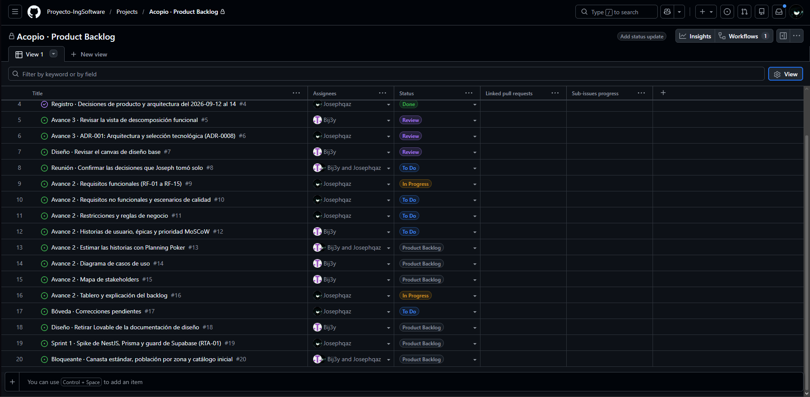

# Avance 2 — Requisitos y planeación inicial

**Guía:** [Avance de Proyecto 2 – IS1](../talleres/Avance%20de%20Proyecto%202%20–%20IS1.pdf)
· Asignado 2026-08-28 · Docente: Juan Pablo Bustamante Moreno

**Dónde se entrega:** en el Word del proyecto, entre el Avance 1 y el Avance 3. No se
crea un archivo nuevo.

> Esta nota es la fuente de trabajo del avance. El texto final va al Word. Cada
> sección tiene su tarea en el
> [tablero](https://github.com/orgs/Proyecto-IngSoftware/projects/1).

| Sección de la guía | Tarea | Estado |
|---|---|---|
| 1. Requisitos funcionales | [#9](https://github.com/Proyecto-IngSoftware/acopio/issues/9) | 🟡 Borrador |
| 2. Requisitos no funcionales y escenarios de calidad | [#10](https://github.com/Proyecto-IngSoftware/acopio/issues/10) | 🟡 Borrador |
| 3. Restricciones y reglas de negocio | [#11](https://github.com/Proyecto-IngSoftware/acopio/issues/11) | 🟡 Borrador |
| 4. Historias de usuario y Product Backlog | [#12](https://github.com/Proyecto-IngSoftware/acopio/issues/12), [#13](https://github.com/Proyecto-IngSoftware/acopio/issues/13), [#16](https://github.com/Proyecto-IngSoftware/acopio/issues/16) | ⬜ |
| 5. Diagrama de casos de uso | [#14](https://github.com/Proyecto-IngSoftware/acopio/issues/14) | ⬜ |
| 6. Mapa de stakeholders | [#15](https://github.com/Proyecto-IngSoftware/acopio/issues/15) | ⬜ |

---

## Dependencia con el Avance 3

El Word del Avance 3 ya afirma que **los seis módulos de la descomposición funcional
son las épicas del Avance 2** y que cada funcionalidad se rastrea hasta su historia de
usuario. Este avance tiene que cumplir esa afirmación:

- Cada RF-xx cae en una de las seis épicas, que son los seis módulos de
  [P-010](../01-requerimientos/pendientes.md).
- Cada RF-xx agrupa RF de la bóveda que ya están en el
  [Anexo A del Avance 3](../03-diseno/descomposicion-funcional/datos.json). Así la
  cadena RF-xx → HU-xx → funcionalidad → módulo queda cerrada.

| Épica | Módulo del Avance 3 | RF del curso |
|---|---|---|
| **EP-01** | Portal público | RF-01, RF-02 |
| **EP-02** | Turnos de voluntariado | RF-03 |
| **EP-03** | Inventario | RF-04, RF-05, RF-06 |
| **EP-04** | Comprobantes y custodia | RF-07, RF-08, RF-09 |
| **EP-05** | Zonas y motor | RF-10, RF-11, RF-12, RF-13 |
| **EP-06** | Administración y acceso | RF-14, RF-15 |

Las épicas se confirman al escribir las historias
([#12](https://github.com/Proyecto-IngSoftware/acopio/issues/12)).

---

## 1. Requisitos funcionales

Quince capacidades observables, una por requisito. Salen de los 75 RF de la bóveda,
agrupados por la capacidad que le dan a un actor. Las condiciones de rol y permiso no
van aquí: van a las reglas de negocio de la sección 3.

| Código | Requisito funcional | Actor o usuario relacionado |
|---|---|---|
| RF-01 | El visitante podrá consultar en un mapa los centros de acopio, con lo que cada uno necesita y lo que ya no recibe. | Visitante (donante o voluntario, sin cuenta) |
| RF-02 | El visitante podrá consultar el directorio de causas verificadas y el paso a paso para donar en el sitio oficial de cada entidad. | Visitante (sin cuenta) |
| RF-03 | El voluntario podrá reservar un cupo en una jornada de voluntariado de un acopio, sin crear una cuenta. | Voluntario |
| RF-04 | El operador podrá registrar la entrada de insumos a su acopio escaneando el código de barras o buscando la categoría por palabra clave. | Operador de acopio |
| RF-05 | El operador podrá consultar el saldo de cada categoría de su acopio, con su nivel de abastecimiento y la antigüedad del dato. | Operador de acopio |
| RF-06 | El operador podrá marcar una categoría como «no recibir» en su acopio, para que se publique de inmediato en el mapa. | Operador de acopio |
| RF-07 | El donador podrá preparar una donación escaneando sus productos y obtener un folio con código QR para presentarlo en el acopio. | Donador (cuenta propia) |
| RF-08 | El auditor podrá conciliar cada donación recibida, comparando lo que declaró el donador con lo que se confirmó en el acopio. | Auditor |
| RF-09 | Cualquier persona podrá consultar con un folio qué se donó y el recorrido de esa donación, sin crear una cuenta. | Cualquier persona (sin cuenta) |
| RF-10 | El administrador podrá aprobar o descartar cada sugerencia de traslado del motor, viendo el déficit de la zona y el excedente del acopio que la justifican. | Administrador |
| RF-11 | El operador podrá despachar una remisión desde su acopio hacia una zona afectada, con un documento imprimible con código QR. | Operador de acopio |
| RF-12 | El receptor podrá confirmar la llegada de un envío a su zona adjuntando al menos una fotografía de evidencia. | Receptor |
| RF-13 | El receptor podrá reportar las categorías de insumos que hacen falta en su zona. | Receptor |
| RF-14 | El administrador podrá dar acceso a la consola interna mediante un enlace de invitación, con un rol y las ubicaciones asignadas. | Administrador |
| RF-15 | El administrador podrá verificar una entidad con un documento soporte, para que sus causas se publiquen en el directorio. | Administrador |

### Criterio de selección

- **El vertical logístico completo** —acopio → inventario → comprobante → motor →
  zona— queda cubierto de punta a punta: RF-04 a RF-13.
- **Cada problema del [Avance 1](avance-01-sprint0.md#problema) tiene al menos un
  requisito:** ayuda concentrada en una causa → RF-02; voluntarios que viajan en vano
  → RF-03; acopios saturados → RF-01, RF-06; reparto sin medir → RF-10, RF-13; sin
  trazabilidad → RF-07 a RF-09, RF-12.
- **Los siete actores con acceso aparecen**: visitante, voluntario, donador, operador,
  receptor, auditor y administrador.
- **Ningún requisito dice «gestionar»** ni describe una tarea técnica. Las cuatro
  reglas del sistema que el Avance 3 deja fuera del diagrama (RF-IDE-005,
  RF-INV-011, RF-CMP-002, RF-TUR-006) pasan como reglas de negocio o como requisitos
  no funcionales.

### Equivalencia con la bóveda

Los códigos RF-01 a RF-15 son del curso. Los de la bóveda (`RF-INV-001`…) no se
renumeran: detallan cada requisito del curso con sus criterios de aceptación. Es el
mismo criterio que ADR-001 del Word y ADR-0008 de la bóveda
([P-011](../01-requerimientos/pendientes.md)).

| RF del curso | RF de la bóveda que lo detallan | Cant. |
|---|---|:-:|
| RF-01 | [RED-002](../01-requerimientos/funcionales/red.md), RED-003, RED-009, RED-011, [HOM-001](../01-requerimientos/funcionales/home.md), HOM-002, HOM-006 | 7 |
| RF-02 | [RED-008](../01-requerimientos/funcionales/red.md), [HOM-005](../01-requerimientos/funcionales/home.md) | 2 |
| RF-03 | [TUR-001 a TUR-007](../01-requerimientos/funcionales/turnos.md) | 7 |
| RF-04 | [INV-001](../01-requerimientos/funcionales/inventario.md), INV-002, INV-004, INV-009, INV-011, [CAT-001](../01-requerimientos/funcionales/catalogo.md), CAT-002, CAT-004, [CMP-001C](../01-requerimientos/funcionales/comprobantes.md) | 9 |
| RF-05 | [INV-005](../01-requerimientos/funcionales/inventario.md), INV-006, INV-010 | 3 |
| RF-06 | [INV-007](../01-requerimientos/funcionales/inventario.md), INV-008 | 2 |
| RF-07 | [CMP-001B](../01-requerimientos/funcionales/comprobantes.md), CMP-001D, CMP-002, CMP-008, [IDE-013](../01-requerimientos/funcionales/identidad.md) | 5 |
| RF-08 | [CMP-003](../01-requerimientos/funcionales/comprobantes.md), CMP-004, CMP-005 | 3 |
| RF-09 | [CMP-006](../01-requerimientos/funcionales/comprobantes.md), CMP-007, [HOM-004](../01-requerimientos/funcionales/home.md) | 3 |
| RF-10 | [MOT-001](../01-requerimientos/funcionales/motor.md) a MOT-007, MOT-010, [RED-004](../01-requerimientos/funcionales/red.md), [CAT-003](../01-requerimientos/funcionales/catalogo.md), CAT-005, CAT-006 | 12 |
| RF-11 | [MOT-008](../01-requerimientos/funcionales/motor.md), [INV-003](../01-requerimientos/funcionales/inventario.md) | 2 |
| RF-12 | [MOT-009](../01-requerimientos/funcionales/motor.md) | 1 |
| RF-13 | [MOT-011](../01-requerimientos/funcionales/motor.md) | 1 |
| RF-14 | [IDE-001 a IDE-012](../01-requerimientos/funcionales/identidad.md) | 12 |
| RF-15 | [RED-001](../01-requerimientos/funcionales/red.md), RED-005, RED-006, RED-007, RED-010, [HOM-003](../01-requerimientos/funcionales/home.md) | 6 |
| | **Total** | **75** |

Los 75 RF de la bóveda quedan asignados, ninguno dos veces.

**Cruces de módulo.** Once RF de la bóveda viven en un módulo del Avance 3 distinto
de la épica de su RF del curso. La épica sigue la capacidad que ve el actor; el
módulo, dónde vive el código. No es una contradicción, pero la tabla de trazabilidad
de la sección 5 tiene que mostrarlo:

| RF de la bóveda | En el RF del curso | Vive en el módulo | Por qué |
|---|---|---|---|
| RED-011 | RF-01 | Administración y acceso | La importación de RedAcopio alimenta el mapa público |
| CAT-001, CAT-002, CAT-004 | RF-04 | Administración y acceso | El catálogo y los códigos de barras son lo que el operador busca y escanea |
| CMP-001C | RF-04 | Comprobantes y custodia | Recibir un folio genera las entradas al inventario |
| IDE-013 | RF-07 | Administración y acceso | Sin cuenta de Donador no hay folio |
| HOM-004 | RF-09 | Portal público | La transparencia muestra el recorrido agregado de las donaciones |
| CAT-003, CAT-005, CAT-006 | RF-10 | Administración y acceso | Canasta, emergencia y pesos son las entradas del cálculo del motor |
| INV-003 | RF-11 | Inventario | Despachar una remisión registra la salida del inventario |

Verificado con un script contra
[datos.json](../03-diseno/descomposicion-funcional/datos.json): 75 asignados, 75
únicos, ninguno sin asignar.

---

## 2. Requisitos no funcionales y escenarios de calidad

Doce condiciones de calidad, cada una con una cifra o una prueba que dice si se
cumple. Salen de los [13 RNF de la bóveda](../01-requerimientos/no-funcionales.md):
del RNF-01 al RNF-11 conservan su número; el de idioma (RNF-12 de la bóveda) se funde
con la legibilidad en RNF-03, porque ambos tratan de cómo se lee un dato; y el de
mantenibilidad (RNF-13 de la bóveda) pasa a ser RNF-12.

| Código | Requisito no funcional | Atributo de calidad | Cómo se verifica |
|---|---|---|---|
| RNF-01 | Toda pantalla de la consola se opera completa en un teléfono de 360 × 640 px, sin desplazamiento horizontal, con áreas táctiles de al menos 48 × 48 px. | Usabilidad — operabilidad en móvil | Recorrido de la entrada rápida en un teléfono real, con una sola mano |
| RNF-02 | Registrar un movimiento de inventario, desde abrir la entrada rápida hasta ver la confirmación, toma menos de 10 segundos. | Usabilidad — eficiencia de uso | Cronómetro: 5 operadores, 3 intentos cada uno, mediana |
| RNF-03 | Todo dato operativo tiene contraste de al menos 7:1 y texto de 16 px o más, y los números y fechas usan el formato de Colombia: `1.240,5 L`, `14 sep 2026, 3:14 p. m.` | Usabilidad — legibilidad | Lighthouse y revisión en exteriores, bajo sol |
| RNF-04 | Todo dato operativo se muestra con su antigüedad («hace 8 min»); si tiene más de 6 horas, se atenúa y lleva advertencia. | Exactitud de la información presentada | Revisión pantalla por pantalla; es criterio de aceptación |
| RNF-05 | La API responde el registro de un movimiento en menos de 500 ms y la consulta de saldos de un acopio en menos de 200 ms; el motor recalcula 50 zonas × 40 categorías en menos de 5 s; la portada muestra contenido útil en menos de 3 s en 3G. | Eficiencia de desempeño | Pruebas de carga con datos sintéticos al cierre de cada bloque |
| RNF-06 | El saldo de una categoría nunca queda negativo, ni con registros simultáneos, y ningún movimiento de inventario se puede editar ni borrar. | Integridad de datos | Prueba automatizada de concurrencia contra PostgreSQL real |
| RNF-07 | Sin conexión, la entrada rápida sigue registrando movimientos en una cola local que se sincroniza al volver la señal; si cae el proveedor de autenticación, las sesiones activas siguen operando. | Disponibilidad — tolerancia a fallos | Prueba en modo avión y con el dominio de Supabase bloqueado |
| RNF-08 | Cada petición a la API verifica la autorización contra la base de datos, así que suspender a un usuario le corta el acceso en su siguiente petición; los archivos solo se entregan por URL firmada de expiración corta. | Seguridad — autenticidad y confidencialidad | Prueba de integración y lista de chequeo en revisión de código |
| RNF-09 | Ninguna superficie pública muestra datos personales: el seguimiento por folio revela el recorrido del insumo, nunca datos del donante ni la factura. El registro de Donador y la reserva de turno piden consentimiento conforme a la Ley 1581 de 2012. | Privacidad — cumplimiento legal | Revisión de cada pantalla pública y de la política de datos |
| RNF-10 | Toda operación de escritura queda en una bitácora que no se puede editar, con usuario, momento, acción y valores anteriores. | Seguridad — responsabilidad y trazabilidad | Prueba: cada endpoint de escritura deja su registro |
| RNF-11 | La consola se opera completa con teclado, sin violaciones críticas de accesibilidad, y el semáforo de inventario lleva ícono y texto además del color. | Usabilidad — accesibilidad | axe-core y recorrido con lector de pantalla en inventario y entrada rápida |
| RNF-12 | El backend tiene un módulo por dominio sin dependencias circulares, y las reglas de negocio puras se escriben una sola vez y las comparten cliente y servidor. | Mantenibilidad — modularidad | Revisión de dependencias entre módulos en cada pull request |

### Escenarios de calidad

Se eligen cuatro, uno por atributo, porque son los que más pesan en la propuesta de
valor: sin integridad el motor propone traslados equivocados; sin rapidez el operador
deja de registrar y el sistema queda ciego; sin tolerancia a fallos se pierde lo que
llega a una bodega sin señal; y sin autorización en cada petición, revocar un acceso no
sirve de nada.

#### Escenario 1 · Integridad del inventario

| Elemento | Descripción |
|---|---|
| Requisito no funcional asociado | RNF-06 |
| Atributo de calidad | Integridad de datos |
| Fuente del estímulo | Dos operadores del mismo acopio |
| Estímulo | Registran al mismo tiempo salidas de la misma categoría, y juntas superan el saldo disponible |
| Artefacto afectado | Registro de movimientos del módulo de inventario y base de datos (RF-04, RF-11) |
| Entorno | Operación normal, con peticiones concurrentes |
| Respuesta esperada | Una salida se confirma; la otra se rechaza con un mensaje claro que muestra el saldo real. Ningún movimiento queda a medias |
| Medida de respuesta | Prueba automatizada con 50 transacciones simultáneas contra PostgreSQL real, repetida 20 veces: 0 saldos negativos, y el saldo final es igual a la suma de los movimientos confirmados en el 100 % de las ejecuciones |

#### Escenario 2 · Registro en menos de diez segundos

| Elemento | Descripción |
|---|---|
| Requisito no funcional asociado | RNF-02 |
| Atributo de calidad | Usabilidad — eficiencia de uso |
| Fuente del estímulo | Operador de acopio |
| Estímulo | Llega un donante con una caja de agua embotellada |
| Artefacto afectado | Pantalla de entrada rápida (RF-04) |
| Entorno | De pie, con una mano ocupada, en un teléfono real con datos móviles, sobre un catálogo de 25 a 40 categorías |
| Respuesta esperada | El operador encuentra la categoría escaneando o escribiendo, marca la cantidad con el teclado numérico y confirma en un solo toque; la pantalla muestra el saldo resultante |
| Medida de respuesta | Cronómetro desde abrir la entrada rápida hasta ver la confirmación: 5 operadores, 3 intentos cada uno, mediana menor a 10 s |

#### Escenario 3 · Registro sin señal

| Elemento | Descripción |
|---|---|
| Requisito no funcional asociado | RNF-07 |
| Atributo de calidad | Disponibilidad — tolerancia a fallos |
| Fuente del estímulo | Pérdida de conexión en la red móvil |
| Estímulo | El operador registra tres entradas mientras el teléfono no tiene datos |
| Artefacto afectado | Entrada rápida y su cola local de movimientos (RF-04) |
| Entorno | Bodega sin cobertura, en un dispositivo que ya había iniciado sesión |
| Respuesta esperada | Las tres entradas quedan en la cola con su hora real de registro; un indicador muestra cuántas faltan por sincronizar y el saldo se marca como estimado. Al volver la señal se envían en orden, sin duplicarse |
| Medida de respuesta | Prueba en modo avión: el 100 % de las entradas llega al servidor, 0 duplicadas, cada una conserva su hora real distinta de la hora de llegada, y la sincronización termina en menos de 60 s después de recuperar la señal *(valor propuesto; la bóveda no fijaba tiempo)* |

#### Escenario 4 · Acceso revocado

| Elemento | Descripción |
|---|---|
| Requisito no funcional asociado | RNF-08 |
| Atributo de calidad | Seguridad — autenticidad |
| Fuente del estímulo | Un usuario interno que el administrador acaba de suspender |
| Estímulo | Intenta registrar un movimiento con su token de sesión, que todavía no vence |
| Artefacto afectado | Autorización de la API (RF-14) |
| Entorno | Producción, con el token firmado y vigente |
| Respuesta esperada | La API rechaza la petición con 403, porque consulta el estado del usuario en la base de datos y no confía en el token; el intento queda en la bitácora |
| Medida de respuesta | Prueba de integración: suspender y reintentar da 403 desde la primera petición siguiente, en el 100 % de los casos, sin esperar a que venza el token |

---

## 3. Restricciones y reglas de negocio

### Restricciones

Condiciones que limitan cómo se puede construir la solución. Ninguna es el calendario
de la asignatura: todas vendrían con el proyecto aunque no fuera académico.

| Código | Restricción | Tipo |
|---|---|---|
| RST-01 | La plataforma opera con presupuesto cero: solo servicios gratuitos o autoalojados. El mapa no puede exigir API key ni tarjeta de crédito, la autenticación usa el plan gratuito de Supabase y la producción corre en un VPS propio con Dokploy. | Infraestructura |
| RST-02 | El tratamiento de datos personales se rige por la Ley 1581 de 2012. No se almacena ningún dato de personas desaparecidas; las facturas son privadas; registrarse y reservar exigen consentimiento; y como las credenciales residen en Supabase, fuera de Colombia, se declara la transferencia internacional. | Legal |
| RST-03 | El mapa y la búsqueda por dirección dependen de OpenStreetMap y Nominatim, bajo sus políticas de uso: máximo una petición por segundo a Nominatim, siempre desde el servidor y con caché; sin descargar mosaicos para uso sin conexión; atribución visible. | Técnica |
| RST-04 | Los acopios de RedAcopio Bogotá se importan sin API pública ni licencia de reutilización. Solo pueden entrar como puntos referenciados —sin inventario—, con la fuente nombrada y enlazada, y leyéndola como máximo una vez por hora. | Datos |
| RST-05 | La autenticación está delegada en Supabase Auth, que solo emite el token. Sin internet no se puede iniciar sesión, y los roles, alcances y reglas de autorización tienen que vivir en la base de datos propia, no en el proveedor. | Técnica |
| RST-06 | La canasta estándar (Manual Esfera) y la población de las zonas (DANE) se usan solo como referencia, sin convenio con esas entidades. Cada valor es configurable y lleva su fuente obligatoria; el motor no puede depender de un número sin cita. | Datos |
| RST-07 | Cuatro personas desarrollan en paralelo, repartidas por módulo. Todo integrante levanta el sistema completo con un solo comando (Docker Compose), y ningún módulo puede depender de otro en ciclo. | Organizacional |

### Reglas de negocio

Normas del problema que el sistema respeta. Aquí van las condiciones de rol y permiso
que la sección 1 dejó fuera de los requisitos.

| Código | Regla de negocio | Relación con requisito funcional |
|---|---|---|
| RN-01 | La plataforma no recibe ni custodia dinero. Toda donación monetaria se hace en el sitio oficial de la entidad, y el paso hacia afuera se advierte. | RF-02 |
| RN-02 | Una entidad solo aparece en el directorio y en la portada si está verificada con un documento soporte. La verificación caduca a los 6 meses; si no se renueva, sus causas se archivan, sin borrarse. | RF-15, RF-02 |
| RN-03 | Un movimiento de inventario nunca se edita ni se borra: un error se corrige con un ajuste de signo contrario y un motivo de al menos 10 caracteres. El saldo de una categoría nunca puede quedar negativo. | RF-04, RF-11 |
| RN-04 | Ninguna sugerencia del motor se ejecuta sola. Solo la aprobación de un administrador genera la remisión, y descartarla exige motivo. | RF-10 |
| RN-05 | Solo quien tiene cuenta de Donador obtiene un folio con seguimiento. Quien no se registra entrega igual, como entrada normal y sin folio. Un Donador tiene a lo sumo 5 donaciones preparadas a la vez, y las que no entrega en 7 días se cancelan *(valores iniciales, P-018)*. | RF-07, RF-09 |
| RN-06 | Operador, receptor y auditor solo actúan sobre las ubicaciones que el administrador les asignó. Solo el administrador crea accesos a la consola; el Donador es la única cuenta que se registra sola, y no tiene ubicaciones. | RF-14, RF-04, RF-08, RF-12 |
| RN-07 | Pueden estar activas varias emergencias a la vez, y un acopio atiende a todas. Al pasar la fecha que se programa al crearla, una emergencia baja de prioridad en el portal, pero el motor la sigue atendiendo según la necesidad de sus zonas. Cerrarla es decisión manual del administrador. | RF-10, RF-01 |

**RN-07 es nueva.** Reemplaza la restricción «una emergencia activa a la vez» que el
Avance 3 incluyó en el ADR-001
([ADR-0010](../02-arquitectura/adr/ADR-0010-varias-emergencias-activas.md)).

**Las cuatro reglas del sistema que el Avance 3 dejó fuera de su diagrama** quedan
cubiertas aquí o en la sección 2: RF-IDE-005 (autorizar cada petición) en RN-06 y
RNF-08; RF-INV-011 (integridad transaccional) en RN-03 y RNF-06; RF-CMP-002
(archivos seguros) en RNF-08 y RNF-09. RF-TUR-006 —los cupos se rotulan como
«reservados», no como «personas presentes»— se vuelve criterio de aceptación de la
historia de RF-03.

---

## 4. Tablero — evidencia

Tablero del equipo en GitHub Projects:
<https://github.com/orgs/Proyecto-IngSoftware/projects/1>

*Captura del 2026-09-14 en vista de tabla. Para el Word conviene la vista de tablero
agrupada por Status, con las cinco columnas de la guía.*
