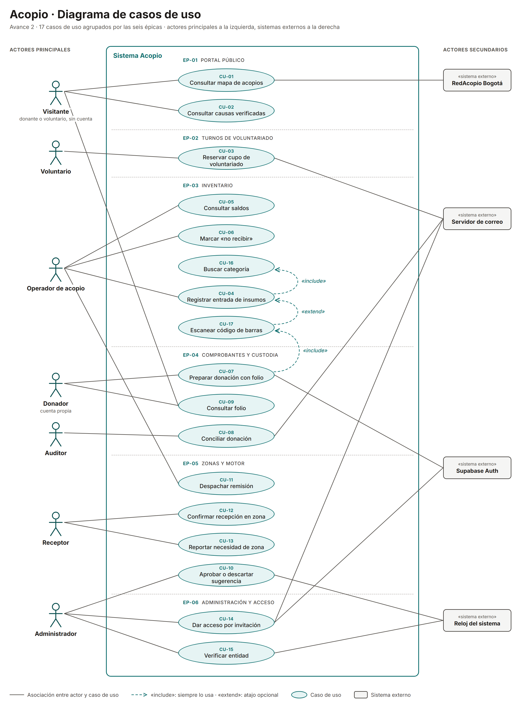
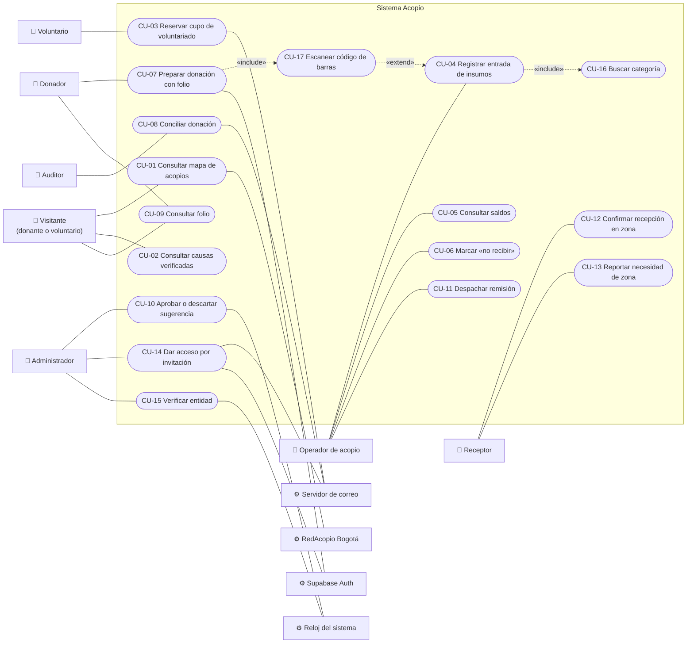
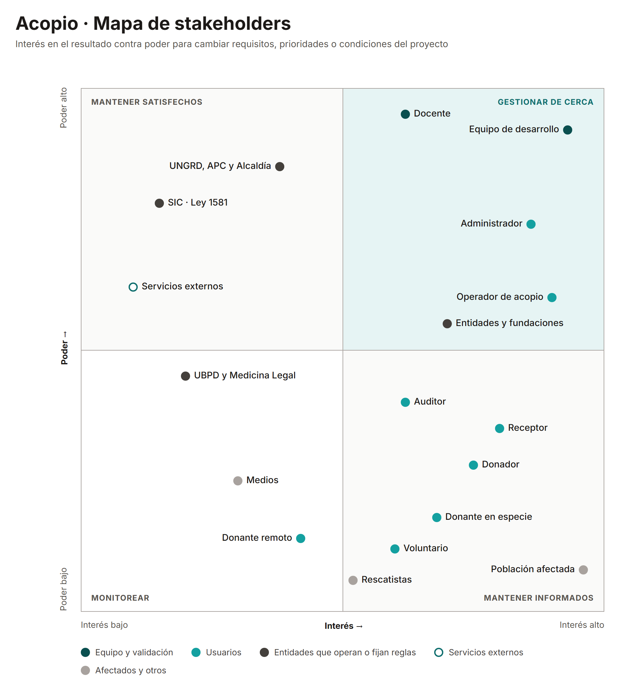
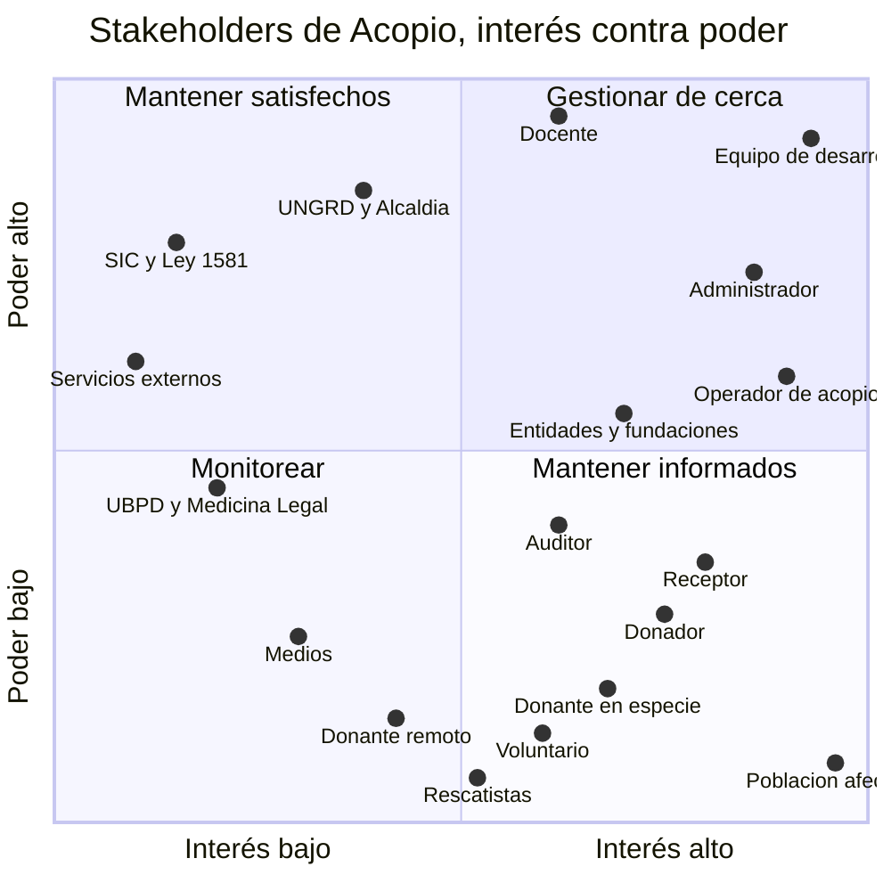

# Avance 2 — Requisitos y planeación inicial

**Guía:** [Avance de Proyecto 2 – IS1](../talleres/Avance%20de%20Proyecto%202%20–%20IS1.pdf)
· Asignado 2026-08-28 · Docente: Juan Pablo Bustamante Moreno

**Dónde se entrega:** en el Word del proyecto, entre el Avance 1 y el Avance 3. No se
crea un archivo nuevo.

> Esta nota es la fuente de trabajo del avance. El texto final va al Word. Cada
> sección tiene su tarea en el
> [tablero](https://github.com/orgs/Proyecto-IngSoftware/projects/1).

| Sección de la guía | Tarea | Estado |
|---|---|---|
| 1. Requisitos funcionales | [#9](https://github.com/Proyecto-IngSoftware/acopio/issues/9) | 🟡 Borrador |
| 2. Requisitos no funcionales y escenarios de calidad | [#10](https://github.com/Proyecto-IngSoftware/acopio/issues/10) | 🟡 Borrador |
| 3. Restricciones y reglas de negocio | [#11](https://github.com/Proyecto-IngSoftware/acopio/issues/11) | 🟡 Borrador |
| 4. Historias de usuario y Product Backlog | [#12](https://github.com/Proyecto-IngSoftware/acopio/issues/12), [#13](https://github.com/Proyecto-IngSoftware/acopio/issues/13), [#16](https://github.com/Proyecto-IngSoftware/acopio/issues/16) | 🟡 Borrador — tamaños por confirmar en Planning Poker |
| 5. Diagrama de casos de uso | [#14](https://github.com/Proyecto-IngSoftware/acopio/issues/14) | 🟡 Borrador |
| 6. Mapa de stakeholders | [#15](https://github.com/Proyecto-IngSoftware/acopio/issues/15) | 🟡 Borrador |

---

## Dependencia con el Avance 3

El Word del Avance 3 ya afirma que **los seis módulos de la descomposición funcional
son las épicas del Avance 2** y que cada funcionalidad se rastrea hasta su historia de
usuario. Este avance tiene que cumplir esa afirmación:

- Cada RF-xx cae en una de las seis épicas, que son los seis módulos de
  [P-010](../01-requerimientos/pendientes.md).
- Cada RF-xx agrupa RF de la bóveda que ya están en el
  [Anexo A del Avance 3](../03-diseno/descomposicion-funcional/datos.json). Así la
  cadena RF-xx → HU-xx → funcionalidad → módulo queda cerrada.

| Épica | Módulo del Avance 3 | RF del curso |
|---|---|---|
| **EP-01** | Portal público | RF-01, RF-02 |
| **EP-02** | Turnos de voluntariado | RF-03 |
| **EP-03** | Inventario | RF-04, RF-05, RF-06 |
| **EP-04** | Comprobantes y custodia | RF-07, RF-08, RF-09 |
| **EP-05** | Zonas y motor | RF-10, RF-11, RF-12, RF-13 |
| **EP-06** | Administración y acceso | RF-14, RF-15 |

Las épicas se confirman al escribir las historias
([#12](https://github.com/Proyecto-IngSoftware/acopio/issues/12)).

---

## 1. Requisitos funcionales

Quince capacidades observables, una por requisito. Salen de los 75 RF de la bóveda,
agrupados por la capacidad que le dan a un actor. Las condiciones de rol y permiso no
van aquí: van a las reglas de negocio de la sección 3.

| Código | Requisito funcional | Actor o usuario relacionado |
|---|---|---|
| RF-01 | El visitante podrá consultar en un mapa los centros de acopio, con lo que cada uno necesita y lo que ya no recibe. | Visitante (donante o voluntario, sin cuenta) |
| RF-02 | El visitante podrá consultar el directorio de causas verificadas y el paso a paso para donar en el sitio oficial de cada entidad. | Visitante (sin cuenta) |
| RF-03 | El voluntario podrá reservar un cupo en una jornada de voluntariado de un acopio, sin crear una cuenta. | Voluntario |
| RF-04 | El operador podrá registrar la entrada de insumos a su acopio escaneando el código de barras o buscando la categoría por palabra clave. | Operador de acopio |
| RF-05 | El operador podrá consultar el saldo de cada categoría de su acopio, con su nivel de abastecimiento y la antigüedad del dato. | Operador de acopio |
| RF-06 | El operador podrá marcar una categoría como «no recibir» en su acopio, para que se publique de inmediato en el mapa. | Operador de acopio |
| RF-07 | El donador podrá preparar una donación escaneando sus productos y obtener un folio con código QR para presentarlo en el acopio. | Donador (cuenta propia) |
| RF-08 | El auditor podrá conciliar cada donación recibida, comparando lo que declaró el donador con lo que se confirmó en el acopio. | Auditor |
| RF-09 | Cualquier persona podrá consultar con un folio qué se donó y el recorrido de esa donación, sin crear una cuenta. | Cualquier persona (sin cuenta) |
| RF-10 | El administrador podrá aprobar o descartar cada sugerencia de traslado del motor, viendo el déficit de la zona y el excedente del acopio que la justifican. | Administrador |
| RF-11 | El operador podrá despachar una remisión desde su acopio hacia una zona afectada, con un documento imprimible con código QR. | Operador de acopio |
| RF-12 | El receptor podrá confirmar la llegada de un envío a su zona adjuntando al menos una fotografía de evidencia. | Receptor |
| RF-13 | El receptor podrá reportar las categorías de insumos que hacen falta en su zona. | Receptor |
| RF-14 | El administrador podrá dar acceso a la consola interna mediante un enlace de invitación, con un rol y las ubicaciones asignadas. | Administrador |
| RF-15 | El administrador podrá verificar una entidad con un documento soporte, para que sus causas se publiquen en el directorio. | Administrador |

### Criterio de selección

- **El vertical logístico completo** —acopio → inventario → comprobante → motor →
  zona— queda cubierto de punta a punta: RF-04 a RF-13.
- **Cada problema del [Avance 1](avance-01-sprint0.md#problema) tiene al menos un
  requisito:** ayuda concentrada en una causa → RF-02; voluntarios que viajan en vano
  → RF-03; acopios saturados → RF-01, RF-06; reparto sin medir → RF-10, RF-13; sin
  trazabilidad → RF-07 a RF-09, RF-12.
- **Los siete actores con acceso aparecen**: visitante, voluntario, donador, operador,
  receptor, auditor y administrador.
- **Ningún requisito dice «gestionar»** ni describe una tarea técnica. Las cuatro
  reglas del sistema que el Avance 3 deja fuera del diagrama (RF-IDE-005,
  RF-INV-011, RF-CMP-002, RF-TUR-006) pasan como reglas de negocio o como requisitos
  no funcionales.

### Equivalencia con la bóveda

Los códigos RF-01 a RF-15 son del curso. Los de la bóveda (`RF-INV-001`…) no se
renumeran: detallan cada requisito del curso con sus criterios de aceptación. Es el
mismo criterio que ADR-001 del Word y ADR-0008 de la bóveda
([P-011](../01-requerimientos/pendientes.md)).

| RF del curso | RF de la bóveda que lo detallan | Cant. |
|---|---|:-:|
| RF-01 | [RED-002](../01-requerimientos/funcionales/red.md), RED-003, RED-009, RED-011, [HOM-001](../01-requerimientos/funcionales/home.md), HOM-002, HOM-006 | 7 |
| RF-02 | [RED-008](../01-requerimientos/funcionales/red.md), [HOM-005](../01-requerimientos/funcionales/home.md) | 2 |
| RF-03 | [TUR-001 a TUR-007](../01-requerimientos/funcionales/turnos.md) | 7 |
| RF-04 | [INV-001](../01-requerimientos/funcionales/inventario.md), INV-002, INV-004, INV-009, INV-011, [CAT-001](../01-requerimientos/funcionales/catalogo.md), CAT-002, CAT-004, [CMP-001C](../01-requerimientos/funcionales/comprobantes.md) | 9 |
| RF-05 | [INV-005](../01-requerimientos/funcionales/inventario.md), INV-006, INV-010 | 3 |
| RF-06 | [INV-007](../01-requerimientos/funcionales/inventario.md), INV-008 | 2 |
| RF-07 | [CMP-001B](../01-requerimientos/funcionales/comprobantes.md), CMP-001D, CMP-002, CMP-008, [IDE-013](../01-requerimientos/funcionales/identidad.md) | 5 |
| RF-08 | [CMP-003](../01-requerimientos/funcionales/comprobantes.md), CMP-004, CMP-005 | 3 |
| RF-09 | [CMP-006](../01-requerimientos/funcionales/comprobantes.md), CMP-007, [HOM-004](../01-requerimientos/funcionales/home.md) | 3 |
| RF-10 | [MOT-001](../01-requerimientos/funcionales/motor.md) a MOT-007, MOT-010, [RED-004](../01-requerimientos/funcionales/red.md), [CAT-003](../01-requerimientos/funcionales/catalogo.md), CAT-005, CAT-006 | 12 |
| RF-11 | [MOT-008](../01-requerimientos/funcionales/motor.md), [INV-003](../01-requerimientos/funcionales/inventario.md) | 2 |
| RF-12 | [MOT-009](../01-requerimientos/funcionales/motor.md) | 1 |
| RF-13 | [MOT-011](../01-requerimientos/funcionales/motor.md) | 1 |
| RF-14 | [IDE-001 a IDE-012](../01-requerimientos/funcionales/identidad.md) | 12 |
| RF-15 | [RED-001](../01-requerimientos/funcionales/red.md), RED-005, RED-006, RED-007, RED-010, [HOM-003](../01-requerimientos/funcionales/home.md) | 6 |
| | **Total** | **75** |

Los 75 RF de la bóveda quedan asignados, ninguno dos veces.

**Cruces de módulo.** Once RF de la bóveda viven en un módulo del Avance 3 distinto
de la épica de su RF del curso. La épica sigue la capacidad que ve el actor; el
módulo, dónde vive el código. No es una contradicción, pero la tabla de trazabilidad
de la sección 5 tiene que mostrarlo:

| RF de la bóveda | En el RF del curso | Vive en el módulo | Por qué |
|---|---|---|---|
| RED-011 | RF-01 | Administración y acceso | La importación de RedAcopio alimenta el mapa público |
| CAT-001, CAT-002, CAT-004 | RF-04 | Administración y acceso | El catálogo y los códigos de barras son lo que el operador busca y escanea |
| CMP-001C | RF-04 | Comprobantes y custodia | Recibir un folio genera las entradas al inventario |
| IDE-013 | RF-07 | Administración y acceso | Sin cuenta de Donador no hay folio |
| HOM-004 | RF-09 | Portal público | La transparencia muestra el recorrido agregado de las donaciones |
| CAT-003, CAT-005, CAT-006 | RF-10 | Administración y acceso | Canasta, emergencia y pesos son las entradas del cálculo del motor |
| INV-003 | RF-11 | Inventario | Despachar una remisión registra la salida del inventario |

Verificado con un script contra
[datos.json](../03-diseno/descomposicion-funcional/datos.json): 75 asignados, 75
únicos, ninguno sin asignar.

---

## 2. Requisitos no funcionales y escenarios de calidad

Doce condiciones de calidad, cada una con una cifra o una prueba que dice si se
cumple. Salen de los [13 RNF de la bóveda](../01-requerimientos/no-funcionales.md):
del RNF-01 al RNF-11 conservan su número; el de idioma (RNF-12 de la bóveda) se funde
con la legibilidad en RNF-03, porque ambos tratan de cómo se lee un dato; y el de
mantenibilidad (RNF-13 de la bóveda) pasa a ser RNF-12.

| Código | Requisito no funcional | Atributo de calidad | Cómo se verifica |
|---|---|---|---|
| RNF-01 | Toda pantalla de la consola se opera completa en un teléfono de 360 × 640 px, sin desplazamiento horizontal, con áreas táctiles de al menos 48 × 48 px. | Usabilidad — operabilidad en móvil | Recorrido de la entrada rápida en un teléfono real, con una sola mano |
| RNF-02 | Registrar un movimiento de inventario, desde abrir la entrada rápida hasta ver la confirmación, toma menos de 10 segundos. | Usabilidad — eficiencia de uso | Cronómetro: 5 operadores, 3 intentos cada uno, mediana |
| RNF-03 | Todo dato operativo tiene contraste de al menos 7:1 y texto de 16 px o más, y los números y fechas usan el formato de Colombia: `1.240,5 L`, `14 sep 2026, 3:14 p. m.` | Usabilidad — legibilidad | Lighthouse y revisión en exteriores, bajo sol |
| RNF-04 | Todo dato operativo se muestra con su antigüedad («hace 8 min»); si tiene más de 6 horas, se atenúa y lleva advertencia. | Exactitud de la información presentada | Revisión pantalla por pantalla; es criterio de aceptación |
| RNF-05 | La API responde el registro de un movimiento en menos de 500 ms y la consulta de saldos de un acopio en menos de 200 ms; el motor recalcula 50 zonas × 40 categorías en menos de 5 s; la portada muestra contenido útil en menos de 3 s en 3G. | Eficiencia de desempeño | Pruebas de carga con datos sintéticos al cierre de cada bloque |
| RNF-06 | El saldo de una categoría nunca queda negativo, ni con registros simultáneos, y ningún movimiento de inventario se puede editar ni borrar. | Integridad de datos | Prueba automatizada de concurrencia contra PostgreSQL real |
| RNF-07 | Sin conexión, la entrada rápida sigue registrando movimientos en una cola local que se sincroniza al volver la señal; si cae el proveedor de autenticación, las sesiones activas siguen operando. | Disponibilidad — tolerancia a fallos | Prueba en modo avión y con el dominio de Supabase bloqueado |
| RNF-08 | Cada petición a la API verifica la autorización contra la base de datos, así que suspender a un usuario le corta el acceso en su siguiente petición; los archivos solo se entregan por URL firmada de expiración corta. | Seguridad — autenticidad y confidencialidad | Prueba de integración y lista de chequeo en revisión de código |
| RNF-09 | Ninguna superficie pública muestra datos personales: el seguimiento por folio revela el recorrido del insumo, nunca datos del donante ni la factura. El registro de Donador y la reserva de turno piden consentimiento conforme a la Ley 1581 de 2012. | Privacidad — cumplimiento legal | Revisión de cada pantalla pública y de la política de datos |
| RNF-10 | Toda operación de escritura queda en una bitácora que no se puede editar, con usuario, momento, acción y valores anteriores. | Seguridad — responsabilidad y trazabilidad | Prueba: cada endpoint de escritura deja su registro |
| RNF-11 | La consola se opera completa con teclado, sin violaciones críticas de accesibilidad, y el semáforo de inventario lleva ícono y texto además del color. | Usabilidad — accesibilidad | axe-core y recorrido con lector de pantalla en inventario y entrada rápida |
| RNF-12 | El backend tiene un módulo por dominio sin dependencias circulares, y las reglas de negocio puras se escriben una sola vez y las comparten cliente y servidor. | Mantenibilidad — modularidad | Revisión de dependencias entre módulos en cada pull request |

### Escenarios de calidad

Se eligen cuatro, uno por atributo, porque son los que más pesan en la propuesta de
valor: sin integridad el motor propone traslados equivocados; sin rapidez el operador
deja de registrar y el sistema queda ciego; sin tolerancia a fallos se pierde lo que
llega a una bodega sin señal; y sin autorización en cada petición, revocar un acceso no
sirve de nada.

#### Escenario 1 · Integridad del inventario

| Elemento | Descripción |
|---|---|
| Requisito no funcional asociado | RNF-06 |
| Atributo de calidad | Integridad de datos |
| Fuente del estímulo | Dos operadores del mismo acopio |
| Estímulo | Registran al mismo tiempo salidas de la misma categoría, y juntas superan el saldo disponible |
| Artefacto afectado | Registro de movimientos del módulo de inventario y base de datos (RF-04, RF-11) |
| Entorno | Operación normal, con peticiones concurrentes |
| Respuesta esperada | Una salida se confirma; la otra se rechaza con un mensaje claro que muestra el saldo real. Ningún movimiento queda a medias |
| Medida de respuesta | Prueba automatizada con 50 transacciones simultáneas contra PostgreSQL real, repetida 20 veces: 0 saldos negativos, y el saldo final es igual a la suma de los movimientos confirmados en el 100 % de las ejecuciones |

#### Escenario 2 · Registro en menos de diez segundos

| Elemento | Descripción |
|---|---|
| Requisito no funcional asociado | RNF-02 |
| Atributo de calidad | Usabilidad — eficiencia de uso |
| Fuente del estímulo | Operador de acopio |
| Estímulo | Llega un donante con una caja de agua embotellada |
| Artefacto afectado | Pantalla de entrada rápida (RF-04) |
| Entorno | De pie, con una mano ocupada, en un teléfono real con datos móviles, sobre un catálogo de 25 a 40 categorías |
| Respuesta esperada | El operador encuentra la categoría escaneando o escribiendo, marca la cantidad con el teclado numérico y confirma en un solo toque; la pantalla muestra el saldo resultante |
| Medida de respuesta | Cronómetro desde abrir la entrada rápida hasta ver la confirmación: 5 operadores, 3 intentos cada uno, mediana menor a 10 s |

#### Escenario 3 · Registro sin señal

| Elemento | Descripción |
|---|---|
| Requisito no funcional asociado | RNF-07 |
| Atributo de calidad | Disponibilidad — tolerancia a fallos |
| Fuente del estímulo | Pérdida de conexión en la red móvil |
| Estímulo | El operador registra tres entradas mientras el teléfono no tiene datos |
| Artefacto afectado | Entrada rápida y su cola local de movimientos (RF-04) |
| Entorno | Bodega sin cobertura, en un dispositivo que ya había iniciado sesión |
| Respuesta esperada | Las tres entradas quedan en la cola con su hora real de registro; un indicador muestra cuántas faltan por sincronizar y el saldo se marca como estimado. Al volver la señal se envían en orden, sin duplicarse |
| Medida de respuesta | Prueba en modo avión: el 100 % de las entradas llega al servidor, 0 duplicadas, cada una conserva su hora real distinta de la hora de llegada, y la sincronización termina en menos de 60 s después de recuperar la señal *(valor propuesto; la bóveda no fijaba tiempo)* |

#### Escenario 4 · Acceso revocado

| Elemento | Descripción |
|---|---|
| Requisito no funcional asociado | RNF-08 |
| Atributo de calidad | Seguridad — autenticidad |
| Fuente del estímulo | Un usuario interno que el administrador acaba de suspender |
| Estímulo | Intenta registrar un movimiento con su token de sesión, que todavía no vence |
| Artefacto afectado | Autorización de la API (RF-14) |
| Entorno | Producción, con el token firmado y vigente |
| Respuesta esperada | La API rechaza la petición con 403, porque consulta el estado del usuario en la base de datos y no confía en el token; el intento queda en la bitácora |
| Medida de respuesta | Prueba de integración: suspender y reintentar da 403 desde la primera petición siguiente, en el 100 % de los casos, sin esperar a que venza el token |

---

## 3. Restricciones y reglas de negocio

### Restricciones

Condiciones que limitan cómo se puede construir la solución. Ninguna es el calendario
de la asignatura: todas vendrían con el proyecto aunque no fuera académico.

| Código | Restricción | Tipo |
|---|---|---|
| RST-01 | La plataforma opera con presupuesto cero: solo servicios gratuitos o autoalojados. El mapa no puede exigir API key ni tarjeta de crédito, la autenticación usa el plan gratuito de Supabase y la producción corre en un VPS propio con Dokploy. | Infraestructura |
| RST-02 | El tratamiento de datos personales se rige por la Ley 1581 de 2012. No se almacena ningún dato de personas desaparecidas; las facturas son privadas; registrarse y reservar exigen consentimiento; y como las credenciales residen en Supabase, fuera de Colombia, se declara la transferencia internacional. | Legal |
| RST-03 | El mapa y la búsqueda por dirección dependen de OpenStreetMap y Nominatim, bajo sus políticas de uso: máximo una petición por segundo a Nominatim, siempre desde el servidor y con caché; sin descargar mosaicos para uso sin conexión; atribución visible. | Técnica |
| RST-04 | Los acopios de RedAcopio Bogotá se importan sin API pública ni licencia de reutilización. Solo pueden entrar como puntos referenciados —sin inventario—, con la fuente nombrada y enlazada, y leyéndola como máximo una vez por hora. | Datos |
| RST-05 | La autenticación está delegada en Supabase Auth, que solo emite el token. Sin internet no se puede iniciar sesión, y los roles, alcances y reglas de autorización tienen que vivir en la base de datos propia, no en el proveedor. | Técnica |
| RST-06 | La canasta estándar (Manual Esfera) y la población de las zonas (DANE) se usan solo como referencia, sin convenio con esas entidades. Cada valor es configurable y lleva su fuente obligatoria; el motor no puede depender de un número sin cita. | Datos |
| RST-07 | Cuatro personas desarrollan en paralelo, repartidas por módulo. Todo integrante levanta el sistema completo con un solo comando (Docker Compose), y ningún módulo puede depender de otro en ciclo. | Organizacional |

### Reglas de negocio

Normas del problema que el sistema respeta. Aquí van las condiciones de rol y permiso
que la sección 1 dejó fuera de los requisitos.

| Código | Regla de negocio | Relación con requisito funcional |
|---|---|---|
| RN-01 | La plataforma no recibe ni custodia dinero. Toda donación monetaria se hace en el sitio oficial de la entidad, y el paso hacia afuera se advierte. | RF-02 |
| RN-02 | Una entidad solo aparece en el directorio y en la portada si está verificada con un documento soporte. La verificación caduca a los 6 meses; si no se renueva, sus causas se archivan, sin borrarse. | RF-15, RF-02 |
| RN-03 | Un movimiento de inventario nunca se edita ni se borra: un error se corrige con un ajuste de signo contrario y un motivo de al menos 10 caracteres. El saldo de una categoría nunca puede quedar negativo. | RF-04, RF-11 |
| RN-04 | Ninguna sugerencia del motor se ejecuta sola. Solo la aprobación de un administrador genera la remisión, y descartarla exige motivo. | RF-10 |
| RN-05 | Solo quien tiene cuenta de Donador obtiene un folio con seguimiento. Quien no se registra entrega igual, como entrada normal y sin folio. Un Donador tiene a lo sumo 5 donaciones preparadas a la vez, y las que no entrega en 7 días se cancelan *(valores iniciales, P-018)*. | RF-07, RF-09 |
| RN-06 | Operador, receptor y auditor solo actúan sobre las ubicaciones que el administrador les asignó. Solo el administrador crea accesos a la consola; el Donador es la única cuenta que se registra sola, y no tiene ubicaciones. | RF-14, RF-04, RF-08, RF-12 |
| RN-07 | Pueden estar activas varias emergencias a la vez, y un acopio atiende a todas. Al pasar la fecha que se programa al crearla, una emergencia baja de prioridad en el portal, pero el motor la sigue atendiendo según la necesidad de sus zonas. Cerrarla es decisión manual del administrador. | RF-10, RF-01 |

**RN-07 es nueva.** Reemplaza la restricción «una emergencia activa a la vez» que el
Avance 3 incluyó en el ADR-001
([ADR-0010](../02-arquitectura/adr/ADR-0010-varias-emergencias-activas.md)).

**Las cuatro reglas del sistema que el Avance 3 dejó fuera de su diagrama** quedan
cubiertas aquí o en la sección 2: RF-IDE-005 (autorizar cada petición) en RN-06 y
RNF-08; RF-INV-011 (integridad transaccional) en RN-03 y RNF-06; RF-CMP-002
(archivos seguros) en RNF-08 y RNF-09. RF-TUR-006 —los cupos se rotulan como
«reservados», no como «personas presentes»— se vuelve criterio de aceptación de la
historia de RF-03.

---

## 4. Historias de usuario y Product Backlog

Una historia por requisito funcional, escrita desde el valor para un rol. Cada una
trae criterios de comportamiento normal y, cuando aplica, de error, permisos o ausencia
de datos.

**Tamaños propuestos** en escala Fibonacci (1, 2, 3, 5, 8, 13), a partir de lo que
exige cada historia en la bóveda. Se confirman en la sesión de Planning Poker
([#13](https://github.com/Proyecto-IngSoftware/acopio/issues/13)). **Prioridad
MoSCoW** a partir de la prioridad de la bóveda (DEBE, DEBERÍA, PODRÍA) y del orden de
recorte de la especificación.

### Historias

#### HU-01 · Saber qué comprar antes de salir

| Épica | RF | Tamaño | Prioridad |
|---|---|:-:|:-:|
| EP-01 Portal público | RF-01 | 8 | Must |

**Como** donante en especie, **quiero** ver en el mapa qué necesita y qué ya no recibe
cada acopio, **para** no comprar justo lo que ya les sobra.

1. **Dado que** un acopio marcó el agua como «no recibir», **cuando** filtro el mapa
   por «qué no recibe: agua», **entonces** ese acopio aparece con el aviso «no traigan
   agua» y la antigüedad del dato.
2. **Dado que** un acopio viene de RedAcopio Bogotá, **cuando** abro su ficha,
   **entonces** veo solo los datos de esa fuente, con su nombre, su enlace y su
   antigüedad, sin «lo que urge» calculado.
3. **Dado que** negué el permiso de ubicación, **cuando** toco «cerca de mí»,
   **entonces** puedo buscar por dirección en su lugar.

#### HU-02 · Donar a una causa real

| Épica | RF | Tamaño | Prioridad |
|---|---|:-:|:-:|
| EP-01 Portal público | RF-02 | 3 | Must |

**Como** donante remoto, **quiero** encontrar causas verificadas con su paso a paso,
**para** donar a una entidad real sin miedo a caer en una estafa.

1. **Dado que** una entidad no está verificada, **cuando** consulto el directorio,
   **entonces** sus causas no aparecen.
2. **Dado que** estoy en la ficha de una causa, **cuando** toco «ir al sitio oficial»,
   **entonces** se me avisa que salgo de la plataforma y que aquí no se recibe dinero.
3. **Dado que** abro la categoría de personas desaparecidas, **cuando** busco cómo
   ayudar, **entonces** solo encuentro enlaces a la UBPD, la Cruz Roja y Medicina
   Legal, sin datos de personas.

#### HU-03 · No viajar en vano

| Épica | RF | Tamaño | Prioridad |
|---|---|:-:|:-:|
| EP-02 Turnos de voluntariado | RF-03 | 5 | Should |

**Como** voluntario, **quiero** reservar un cupo antes de desplazarme, **para** no
cruzar la ciudad y que me devuelvan porque ya hay suficiente gente.

1. **Dado que** queda un cupo y dos personas reservan a la vez, **cuando** ambas
   confirman, **entonces** solo una obtiene el cupo y la otra recibe un mensaje claro.
2. **Dado que** ya reservé con mi correo, **cuando** intento reservar de nuevo la misma
   jornada, **entonces** el sistema lo rechaza.
3. **Dado que** consulto una jornada, **cuando** veo sus cupos, **entonces** el dato
   dice «cupos reservados», no «personas presentes».

#### HU-04 · Registrar sin frenar la fila

| Épica | RF | Tamaño | Prioridad |
|---|---|:-:|:-:|
| EP-03 Inventario | RF-04 | 8 | Must |

**Como** operador de acopio, **quiero** registrar una entrada en menos de diez
segundos, **para** no detener la descarga ni dejar de anotar por falta de tiempo.

1. **Dado que** escaneo un código de barras conocido, **cuando** escribo la cantidad y
   confirmo con un toque, **entonces** la entrada queda registrada y veo el saldo
   resultante.
2. **Dado que** la categoría es perecedera, **cuando** no escribo la fecha de
   vencimiento, **entonces** el sistema no me deja confirmar.
3. **Dado que** la categoría está en «no recibir», **cuando** registro la entrada,
   **entonces** se me advierte, pero no se bloquea: la donación ya llegó.

#### HU-05 · Ver qué sobra y qué falta

| Épica | RF | Tamaño | Prioridad |
|---|---|:-:|:-:|
| EP-03 Inventario | RF-05 | 5 | Must |

**Como** operador de acopio, **quiero** ver el saldo de cada categoría con su nivel y
su antigüedad, **para** saber de un vistazo qué sobra y qué falta.

1. **Dado que** el saldo de una categoría está bajo su mínimo, **cuando** consulto el
   inventario, **entonces** aparece como escaso, con ícono y texto además del color.
2. **Dado que** el último movimiento de una categoría tiene más de 6 horas, **cuando**
   la consulto, **entonces** el dato aparece atenuado y con advertencia.

#### HU-06 · Frenar lo que ya sobra

| Épica | RF | Tamaño | Prioridad |
|---|---|:-:|:-:|
| EP-03 Inventario | RF-06 | 3 | Must |

**Como** operador de acopio, **quiero** marcar una categoría como «no recibir» y que
se vea en el mapa, **para** dejar de recibir agua cuando ya no me cabe.

1. **Dado que** marco el agua como «no recibir», **cuando** un visitante abre el mapa,
   **entonces** ve de inmediato mi acopio en el filtro «qué no recibe: agua».
2. **Dado que** programé una fecha de reapertura, **cuando** llega esa fecha,
   **entonces** la categoría vuelve a recibirse sola.
3. **Dado que** un operador no está asignado a mi acopio, **cuando** intenta marcar
   una categoría, **entonces** el sistema lo rechaza.

#### HU-07 · Preparar una donación que pueda demostrar

| Épica | RF | Tamaño | Prioridad |
|---|---|:-:|:-:|
| EP-04 Comprobantes y custodia | RF-07 | 8 | Must |

**Como** Donador, **quiero** preparar mi donación escaneando los productos y obtener
un folio con QR, **para** rendirle cuentas exactas a quienes me confiaron la
donación.

1. **Dado que** escaneo dos veces el mismo producto, **cuando** reviso la lista,
   **entonces** la cantidad se suma en la misma línea.
2. **Dado que** un acopio tiene alguna de mis líneas en «no recibir», **cuando** el
   sistema me sugiere dónde entregar, **entonces** marca esa línea antes de que elija.
3. **Dado que** ya tengo 5 donaciones preparadas sin entregar, **cuando** intento
   preparar otra, **entonces** el sistema la rechaza y me explica por qué.

#### HU-08 · Conciliar sin depender de una foto

| Épica | RF | Tamaño | Prioridad |
|---|---|:-:|:-:|
| EP-04 Comprobantes y custodia | RF-08 | 5 | Must |

**Como** auditor, **quiero** comparar lo que declaró el Donador con lo que confirmó
el acopio, **para** conciliar cada donación con datos y no con una foto.

1. **Dado que** un comprobante recibido no tiene diferencias, **cuando** lo apruebo,
   **entonces** pasa a conciliado y queda registrado quién y cuándo.
2. **Dado que** rechazo un comprobante, **cuando** no escribo el motivo, **entonces**
   el sistema no me deja; al rechazarlo, se avisa al Donador y la mercancía no se
   borra del inventario.

#### HU-09 · Comprobar que mi donación llegó

| Épica | RF | Tamaño | Prioridad |
|---|---|:-:|:-:|
| EP-04 Comprobantes y custodia | RF-09 | 3 | Must |

**Como** Donador, **quiero** compartir un folio que cualquiera pueda consultar,
**para** que quienes me siguen verifiquen que la donación llegó.

1. **Dado que** mi folio está conciliado y no se vinculó a ningún despacho, **cuando**
   alguien lo consulta, **entonces** ve qué se donó y el estado «conciliado, en el
   acopio», sin un destino inventado.
2. **Dado que** alguien consulta un folio inexistente, **cuando** lo busca,
   **entonces** recibe el mismo mensaje genérico que para uno no encontrado, y ninguna
   consulta muestra datos del donante ni la factura.

#### HU-10 · Mandar lo que falta a donde falta

| Épica | RF | Tamaño | Prioridad |
|---|---|:-:|:-:|
| EP-05 Zonas y motor | RF-10 | **13** | Must |

**Como** administrador, **quiero** aprobar o descartar las sugerencias de traslado con
su justificación, **para** decidir cada envío con un dato y no con una corazonada.

1. **Dado que** una zona tiene 12 % de cobertura en agua y un acopio tiene 800 L sobre
   su máximo, **cuando** reviso el ranking, **entonces** la sugerencia explica ambos
   datos y la distancia entre los dos.
2. **Dado que** descarto una sugerencia, **cuando** no escribo el motivo, **entonces**
   el sistema no me deja.
3. **Dado que** apruebo una sugerencia, **cuando** confirmo, **entonces** se crea la
   remisión en borrador y queda registrado quién aprobó. Ninguna sugerencia se
   ejecuta sin aprobación.

**Tamaño 13: se divide antes de planearse.** Contiene el cálculo de déficit y
superávit y el ranking, que son el núcleo del motor. En el Sprint del Bloque 4 se
parte en dos historias: calcular y presentar el ranking con su justificación, y
aprobar o descartar.

#### HU-11 · Despachar con un documento verificable

| Épica | RF | Tamaño | Prioridad |
|---|---|:-:|:-:|
| EP-05 Zonas y motor | RF-11 | 5 | Must |

**Como** operador de acopio, **quiero** despachar una remisión con código QR,
**para** que el camión salga con un documento que cualquiera en destino pueda
verificar.

1. **Dado que** una línea de la remisión supera el saldo del acopio, **cuando**
   intento despacharla, **entonces** el sistema la rechaza.
2. **Dado que** no se sabe todavía a qué zona va el camión, **cuando** la despacho
   como despacho general, **entonces** pasa a «en tránsito» y se registran las salidas
   del inventario.

#### HU-12 · Confirmar la llegada sin contar unidad por unidad

| Épica | RF | Tamaño | Prioridad |
|---|---|:-:|:-:|
| EP-05 Zonas y motor | RF-12 | 3 | Must |

**Como** receptor, **quiero** confirmar que llegó un envío con un botón y una foto,
**para** no tener que contar unidad por unidad en plena urgencia.

1. **Dado que** no adjunté ninguna foto, **cuando** toco «Recibido», **entonces** el
   sistema no me deja confirmar.
2. **Dado que** el envío era un despacho general, **cuando** lo confirmo,
   **entonces** queda asignado a mi zona.

#### HU-13 · Contar lo que la fórmula no ve

| Épica | RF | Tamaño | Prioridad |
|---|---|:-:|:-:|
| EP-05 Zonas y motor | RF-13 | 3 | Must |

**Como** receptor, **quiero** reportar lo que hace falta en mi zona, **para** que
donantes y administración sepan lo que el cálculo no puede anticipar.

1. **Dado que** reporto que faltan medicamentos, **cuando** un visitante abre el mapa,
   **entonces** ve esa necesidad en un área aproximada de la zona, con su antigüedad y
   sin una dirección exacta.
2. **Dado que** la necesidad ya se cubrió, **cuando** la marco como resuelta,
   **entonces** deja de mostrarse como vigente sin borrar el historial.

#### HU-14 · Dar acceso sin conocer contraseñas

| Épica | RF | Tamaño | Prioridad |
|---|---|:-:|:-:|
| EP-06 Administración y acceso | RF-14 | 8 | Must |

**Como** administrador, **quiero** crear un usuario y enviarle un enlace para que él
defina su contraseña, **para** darle acceso sin quedar en posición de conocer su
clave.

1. **Dado que** el enlace de invitación venció o ya se usó, **cuando** la persona lo
   abre, **entonces** ve un mensaje genérico y no puede crear la contraseña.
2. **Dado que** suspendí a un usuario, **cuando** intenta hacer algo con su sesión aún
   vigente, **entonces** el sistema lo rechaza desde su siguiente petición.
3. **Dado que** creo un usuario sin correo, **cuando** guardo, **entonces** el sistema
   advierte que no podrá recuperar su contraseña por sí mismo.

#### HU-15 · No dirigir donantes a una estafa

| Épica | RF | Tamaño | Prioridad |
|---|---|:-:|:-:|
| EP-06 Administración y acceso | RF-15 | 3 | Must |

**Como** administrador, **quiero** verificar cada entidad con un documento soporte,
**para** no dirigir a los donantes hacia una estafa.

1. **Dado que** no adjunté un documento soporte, **cuando** intento verificar una
   entidad, **entonces** el sistema no me deja.
2. **Dado que** la verificación de una entidad cumplió 6 meses sin renovarse,
   **cuando** pasa la revisión diaria, **entonces** sus causas se archivan y siguen
   visibles en el filtro de causas atendidas.

### Épicas

| Épica | Qué agrupa | Historias | Tamaño total |
|---|---|---|:-:|
| **EP-01 Portal público** | Lo que ve cualquiera sin cuenta: mapa, causas, portada | HU-01, HU-02 | 11 |
| **EP-02 Turnos de voluntariado** | Jornadas y reservas de cupo | HU-03 | 5 |
| **EP-03 Inventario** | Movimientos, saldos y «no recibir» del acopio | HU-04, HU-05, HU-06 | 16 |
| **EP-04 Comprobantes y custodia** | Donación con folio, conciliación y seguimiento | HU-07, HU-08, HU-09 | 16 |
| **EP-05 Zonas y motor** | Déficit, sugerencias, remisiones y recepción en zona | HU-10 a HU-13 | 24 |
| **EP-06 Administración y acceso** | Usuarios, invitaciones y verificación de entidades | HU-14, HU-15 | 11 |
| | | **15 historias** | **83** |

Son los mismos seis módulos de la vista de descomposición funcional del Avance 3.

### Product Backlog

**Qué va primero.** El orden sigue las dependencias del
[orden de construcción](../superpowers/specs/2026-08-20-acopio-design.md#13-orden-de-construcción):
acceso y catálogo (HU-14) antes que todo; después la red pública (HU-01, HU-02,
HU-15); luego el inventario (HU-04 a HU-06), la custodia (HU-07 a HU-09) y el motor
(HU-10 a HU-13); por último los turnos (HU-03).

| Prioridad | Historias | Por qué |
|---|---|---|
| **Must** | HU-01, HU-02, HU-04 a HU-15 | El vertical logístico completo y el portal que lo hace útil. Sin ellos no hay aporte original |
| **Should** | HU-03 | Turnos es el primer recorte si el calendario aprieta; se conserva la reserva básica |
| **Could** | Captura sin conexión (RF-INV-009), voluntariado especializado (RF-TUR-007), matriz de acceso exportable (RF-IDE-011) | Detalles de requisitos del curso que se pueden aplazar sin romper el flujo |
| **Won't** (esta versión) | Pagos, datos de personas desaparecidas, optimización de rutas, conteo físico de personas, doble factor | Descartados con razón escrita en [fuera de alcance](../00-contexto/fuera-de-alcance.md) |

**Qué necesita más análisis.** HU-10 (tamaño 13) se divide antes de planearse, y
depende de datos que todavía no existen.

**Dependencias y spike.**
- **Spike — NestJS, Prisma y el guard de Supabase**
  ([#19](https://github.com/Proyecto-IngSoftware/acopio/issues/19)). El equipo no ha
  usado NestJS; antes de estimar el Bloque 0 se construye un módulo completo y el guard
  que valida el token (RTA-01 del ADR-001).
- **Dependencia bloqueante — canasta estándar, población por zona y catálogo inicial**
  ([#20](https://github.com/Proyecto-IngSoftware/acopio/issues/20)). HU-10 no se
  puede terminar sin los valores de P-001 y P-002, y HU-04 necesita el catálogo de
  P-003.
- **Dependencia de orden** — HU-10 a HU-13 exigen el inventario (HU-04 a HU-06) y la
  custodia (HU-07 a HU-09) terminados: el motor calcula sobre esos datos.

### Tablero

Tablero del equipo en GitHub Projects, con las columnas Product Backlog · To Do · In
Progress · Review · Done, responsables, etiquetas y lista de tareas en cada tarjeta:
<https://github.com/orgs/Proyecto-IngSoftware/projects/1>

*Captura del 2026-09-14 en vista de tabla. Para el Word conviene la vista de tablero
agrupada por Status, con las cinco columnas de la guía.*

---

## 5. Diagrama de casos de uso

Delimita el sistema y valida que cada actor se relaciona con lo que el sistema le
ofrece. `include` y `extend` aparecen solo donde un caso de uso reutiliza a otro.

Versión editable en el
[lienzo de diagramas del Avance 2](https://claude.ai/code/artifact/026f819a-5775-4db8-92e5-44abc21cc9a3),
generado desde [build.mjs](../03-diseno/avance2-diagramas/build.mjs). El bloque
Mermaid de abajo es la misma estructura en texto, para leerla en GitHub u Obsidian.

**Cómo se lee.**
- **Actores principales**, a la izquierda: los siete que usan el sistema. Los cuatro
  internos entran por la consola; el Donador tiene cuenta propia; visitante y
  voluntario no tienen cuenta.
- **Actores secundarios**, a la derecha: sistemas externos de los que depende un caso
  de uso. Supabase Auth autentica, el servidor de correo envía invitaciones y avisos,
  RedAcopio alimenta el mapa con puntos referenciados, y el reloj del sistema dispara
  el recálculo del motor cada 15 minutos y la caducidad de las verificaciones.
- **`include`**: registrar una entrada siempre busca la categoría (CU-16), y preparar
  una donación siempre escanea (CU-17). **`extend`**: el escaneo es un atajo opcional
  al registrar una entrada; la entrada manual sigue disponible.

### Trazabilidad

| Requisito funcional | Historia de usuario | Caso de uso |
|---|---|---|
| RF-01 | HU-01 | CU-01 |
| RF-02 | HU-02 | CU-02 |
| RF-03 | HU-03 | CU-03 |
| RF-04 | HU-04 | CU-04, con CU-16 y CU-17 |
| RF-05 | HU-05 | CU-05 |
| RF-06 | HU-06 | CU-06 |
| RF-07 | HU-07 | CU-07, con CU-17 |
| RF-08 | HU-08 | CU-08 |
| RF-09 | HU-09 | CU-09 |
| RF-10 | HU-10 | CU-10 |
| RF-11 | HU-11 | CU-11 |
| RF-12 | HU-12 | CU-12 |
| RF-13 | HU-13 | CU-13 |
| RF-14 | HU-14 | CU-14 |
| RF-15 | HU-15 | CU-15 |

CU-16 y CU-17 no tienen historia propia: son pasos compartidos que detallan RF-04 y
RF-07 (RF-CAT-002 y RF-INV-002 de la bóveda).

---

## 6. Mapa de stakeholders

Matriz de interés contra poder. El interés mide cuánto le afecta el resultado; el
poder, cuánto puede cambiar los requisitos, las prioridades o las condiciones del
proyecto.

Versión editable en el mismo
[lienzo de diagramas del Avance 2](https://claude.ai/code/artifact/026f819a-5775-4db8-92e5-44abc21cc9a3).
El bloque Mermaid de abajo es la versión en texto.

| Stakeholder | Tipo | Relación principal con el sistema |
|---|---|---|
| Equipo de desarrollo | Quien construye | Decide requisitos y prioridades dentro del alcance |
| Docente | Valida la propuesta | Evalúa y retroalimenta cada avance; puede pedir cambios |
| Administrador | Administrador | Gobierna la plataforma: accesos, zonas, entidades, sugerencias |
| Operador de acopio | Usuario principal | Alimenta el inventario; sin su registro el sistema queda ciego |
| Receptor | Usuario principal | Confirma la llegada de envíos y reporta necesidades de su zona |
| Auditor | Usuario secundario | Concilia donaciones y audita en solo lectura |
| Donador | Usuario principal | Prepara donaciones con folio y rinde cuentas con él |
| Donante en especie, voluntario, donante remoto | Usuarios sin cuenta | Consultan el mapa, reservan cupos y siguen causas |
| Entidades y fundaciones (Cruz Roja, Bancos de Alimentos, parroquias) | Operan acopios y causas | Aparecen verificadas; administran puntos de acopio |
| UNGRD, APC, Alcaldía de Bogotá e IDIGER | Definen reglas | Fijan qué se dona, a dónde y cuándo; su guía justifica «no recibir» |
| SIC y Ley 1581 de 2012 | Definen restricciones | Imponen cómo se tratan los datos personales |
| UBPD y Medicina Legal | Definen restricciones | Tienen el mandato sobre personas desaparecidas; la plataforma solo enlaza |
| Servicios externos (Supabase, OpenStreetMap, Nominatim, RedAcopio, correo) | Sistemas externos | Su disponibilidad y sus políticas de uso condicionan la operación |
| Población afectada y rescatistas | Afectados | Beneficiarios finales; no usan la plataforma |
| Medios de comunicación | Usuarios secundarios | Consumen las métricas públicas de transparencia |

**¿Quién tiene mayor interés, quién mayor poder y qué actor externo puede condicionar
el proyecto?** El mayor interés lo tienen quienes dependen del dato para actuar: el
operador de acopio, que es el usuario crítico, y el administrador, junto con la
población afectada, que es la beneficiaria final aunque no use el sistema. El mayor
poder para modificar requisitos y prioridades lo tienen el equipo de desarrollo, que
decide el alcance, y el docente, que valida cada avance. Entre los externos, pueden
condicionar el proyecto la UNGRD y las autoridades locales, que definen qué ayuda se
acepta y a dónde va; la Superintendencia de Industria y Comercio, que vigila la Ley
1581; y los servicios gratuitos de los que depende la operación —Supabase,
OpenStreetMap y RedAcopio—, cuyas políticas de uso pueden cambiar sin aviso.
